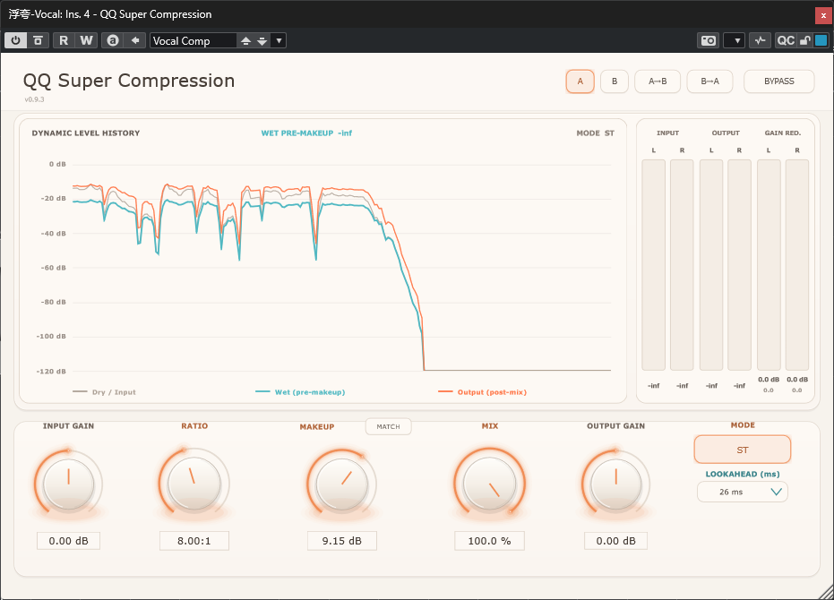

这是一个AI开发项目，大部分文字是由ChatGpt编辑，这些文字同时供用户和AI阅读。

所以如果你看到命令用语，那是给AI看的。

这个效果器看起来像是一个压缩，但其算法本质却与传统压缩效果器完全不同。

我最初设计它的初衷是，无阈值、无启动时间释放时间对瞬态的影响，另外还要像手动画音量Automation一样干净透明无染色。

有音频经验的人应该知道，对正弦波进行扭曲一定会引入谐波失真。

在没有Attack和Release表现下硬拐，如何降低谐波失真是一个很严肃的问题。

最终我找到的方案是，用lookahead的延迟去换取干净透明的声音。

不过到了后期，我发现在算法稳定后，引入阈值概念也是可以的。

这个效果器本质上是一个Dynamic Processor，这也是我不称其为“Compressor”而叫“Compression”的原因。


This is an AI‑development project. Most of the text was edited by ChatGPT, and these texts are meant to be read by both users and the AI.

if you see command‑style phrasing, those are intended for the AI.

This effect unit appears to function as a compressor, yet its underlying algorithm is fundamentally different from conventional compressors.

My original design goal was to eliminate threshold‑, attack‑ and release‑related influences on transients. On top of that, it needed to remain clean, transparent and color‑free, much like manually drawing volume automation.

Anyone with audio experience will know that distorting a sine wave inevitably introduces harmonic distortion.

Hard‑cornering without attack and release behaviour poses a serious challenge: how to reduce harmonic distortion.

The solution I ultimately arrived at is to trade lookahead latency for a clean, transparent sound.

Later on, however, once the algorithm became stable, I found it feasible to introduce a threshold parameter.

At its core, this is a dynamic processor. That is why I refer to it as "Compression" rather than a "Compressor".

↑↑↑↑↑↑↑↑↑↑这是作者自己写的 Wtitten By Author↑↑↑↑↑↑↑↑↑↑


# QQ Super Compression 1.0.3

**Qing Audio 开源动态处理器 / Open-source dynamics processor by Qing Audio**

QQ Super Compression 面向一个具体的混音问题：素材需要动态收敛，但工程师不希望传统压缩器的 Attack / Release 同时重塑原始瞬态、音头和演奏表情。

QQ Super Compression addresses a specific mixing problem: the source needs dynamic control, but the engineer does not want conventional Attack / Release behaviour to reshape its original transient, onset, or articulation.

| 项目 / Item | 内容 / Value |
|---|---|
| 当前版本 / Current version | 1.0.3 |
| 状态 / Status | Stable baseline — Plan A/B/C/D completed; four final artifacts verified / 稳定基线——Plan A/B/C/D 已完成；四类最终成品已核验 |
| 厂商 / Vendor | Qing Audio |
| 格式 / Formats | Windows x64 VST3; macOS Apple Silicon VST3; macOS Intel VST3; macOS Universal 2 AU |
| 框架 / Framework | JUCE 8.0.15 / CMake / C++17 |
| 许可证 / License | MIT |

> **1.0.3 稳定基线 / Stable baseline:** 按既定 Plan D 规则，Centered Domain Monitor 版本现为稳定源码基线。最终构建源码为 [`0ef89e19`](https://github.com/Ziqing-Gu/QQ-Super-Compression/commit/0ef89e19dd7e74ec5588f64501a951c8487efb9c)，对应 `v1.0.3` 标签。Windows x64 VST3、macOS Apple Silicon VST3、macOS Intel VST3 与 Universal 2 AU 均由该提交的 Actions 成功构建；AU 同时通过 `auval`。Cubase 中的最终试听、界面与自动化复核仍由用户完成。
>
> **Stable baseline:** Under the established Plan D rule, Centered Domain Monitor is now the stable source baseline. The final build source is [`0ef89e19`](https://github.com/Ziqing-Gu/QQ-Super-Compression/commit/0ef89e19dd7e74ec5588f64501a951c8487efb9c), tagged `v1.0.3`. Windows x64 VST3, macOS Apple Silicon VST3, macOS Intel VST3, and Universal 2 AU all passed Actions from that commit; the AU also passed `auval`. Final Cubase listening, UI, and automation checks remain user-side verification.


## 1.0.3 更新 / 1.0.3 update

1.0.3 是从用户确认的 1.0.2 Complete Relative LINK 稳定基线出发的窄范围试听工作流版本。它新增 LR 的 `ALL / L / R` 与 MS 的 `ALL / M / S` 居中监听：L、R、S 复制到双输出时使用 `1/sqrt(2)`（-3.0103 dB）补偿；M 以 unity 复制到双输出，不再额外降低 3.01 dB。ST 不显示 Monitor。

Version 1.0.3 is a focused audition-workflow addition built from the user-confirmed 1.0.2 Complete Relative LINK stable baseline. It adds centered monitoring in LR (`ALL / L / R`) and MS (`ALL / M / S`): L, R, and S are copied to both outputs with `1/sqrt(2)` (-3.0103 dB) compensation, while M is copied at unity with no additional 3.01 dB reduction. Monitor is hidden in ST.

Monitor 只作用于最终可听输出。Dynamic Display、meters、Match、压缩/Makeup/Mix/Output Gain 的分析结果仍保持 Monitor 前的正常立体声结果；True Bypass 不应用 Monitor。LR 与 MS 的选择会分别随工程保存，但不进入 A/B 声音快照，也不是 APVTS/宿主自动化参数。

Monitor affects only the final audible output. Dynamic Display, meters, Match, and the compression/Makeup/Mix/Output Gain analysis results remain the normal pre-monitor stereo result; True Bypass does not apply Monitor. LR and MS selections persist independently with the project, but are outside A/B sound snapshots and are not APVTS/host-automation parameters.

Plan A 已完成 JUCE 8.0.15 / MSVC Windows x64 VST3 Release 构建、七项源码/数学自测、BS.1770 自测与 Steinberg validator。Plan D 已从同一最终提交完成 Windows x64 VST3、macOS Apple Silicon VST3、macOS Intel VST3 与 Universal 2 AU 的 Actions 构建和成品核验；AU 已通过 `auval`。因此 1.0.3 已记录为稳定基线，1.0.2 保留为已验证的回滚参考。

Plan A completed the JUCE 8.0.15 / MSVC Windows x64 VST3 Release build, seven source/math self-tests, the BS.1770 self-test, and Steinberg validation. Plan D completed Actions builds and artifact verification for Windows x64 VST3, macOS Apple Silicon VST3, macOS Intel VST3, and Universal 2 AU from the same final commit; the AU passed `auval`. Version 1.0.3 is therefore recorded as the stable baseline, while 1.0.2 remains a verified rollback reference.

- [1.0.3 English installation guide](docs/QQ-Super-Compression-1.0.3-Windows-macOS-INSTALL.txt)
- [1.0.3 中文安装说明](docs/QQ%20Super%20Compression%201.0.3%20Windows%E4%B8%8EmacOS%20%E5%AE%89%E8%A3%85%E8%AF%B4%E6%98%8E%EF%BC%88%E4%B8%AD%E6%96%87%EF%BC%89.txt)

## 下载 / Download

> **最新公开 Release / Latest public Release:** [QQ Super Compression 1.0.3](https://github.com/Ziqing-Gu/QQ-Super-Compression/releases/tag/v1.0.3) 已发布。下载唯一的完整 Plan D RAR 资产后解压；本次 Plan G 只发布用户提供的已验证交付包，未重新构建。
>
> **Latest public Release:** [QQ Super Compression 1.0.3](https://github.com/Ziqing-Gu/QQ-Super-Compression/releases/tag/v1.0.3) is published. Download and extract the single complete Plan D RAR asset; this Plan G run publishes the user-provided verified handoff and does not rebuild it.

- [最新 Release 页面 / Latest Release page](https://github.com/Ziqing-Gu/QQ-Super-Compression/releases/latest)
- [v1.0.3 Release 页面 / v1.0.3 Release page](https://github.com/Ziqing-Gu/QQ-Super-Compression/releases/tag/v1.0.3)
- [直接下载完整包 / Direct download — `QQ.Super.Compression.1.0.3.Plan.D.20260830.rar`](https://github.com/Ziqing-Gu/QQ-Super-Compression/releases/download/v1.0.3/QQ.Super.Compression.1.0.3.Plan.D.20260830.rar)
- [1.0.3 中文安装说明（源码直链；RAR 内亦包含）/ Chinese installation guide (source direct link; also inside RAR)](https://raw.githubusercontent.com/Ziqing-Gu/QQ-Super-Compression/main/docs/QQ%20Super%20Compression%201.0.3%20Windows%E4%B8%8EmacOS%20%E5%AE%89%E8%A3%85%E8%AF%B4%E6%98%8E%EF%BC%88%E4%B8%AD%E6%96%87%EF%BC%89.txt)
- [1.0.3 English installation guide (source direct link; also inside RAR)](https://raw.githubusercontent.com/Ziqing-Gu/QQ-Super-Compression/main/docs/QQ-Super-Compression-1.0.3-Windows-macOS-INSTALL.txt)

解压 `
QQ.Super.Compression.1.0.3.Plan.D.20260830.rar
` 后：Windows 使用 `Win/QQ-Super-Compression-1.0.3-Windows-x64.zip`；Apple Silicon/M 系列 Mac 使用 `Mac/QQ-Super-Compression-1.0.3-macOS-Apple-Silicon-VST3.zip`；Intel Mac 使用 `Mac/QQ-Super-Compression-1.0.3-macOS-Intel-VST3.zip`；Logic Pro 等 AU 宿主使用 `Mac/QQ-Super-Compression-1.0.3-macOS-Universal-AU.zip`。不要同时安装两套不同架构的 macOS VST3。RAR 内另含两份安装说明和保留真实 v1.0.1 标识的历史 PDF 手册；Linux、AAX 与独立应用版本不提供。

After extracting `
QQ.Super.Compression.1.0.3.Plan.D.20260830.rar
`: Windows uses `Win/QQ-Super-Compression-1.0.3-Windows-x64.zip`; Apple Silicon/M-series Macs use `Mac/QQ-Super-Compression-1.0.3-macOS-Apple-Silicon-VST3.zip`; Intel Macs use `Mac/QQ-Super-Compression-1.0.3-macOS-Intel-VST3.zip`; Logic Pro and other AU hosts use `Mac/QQ-Super-Compression-1.0.3-macOS-Universal-AU.zip`. Do not install both macOS VST3 architectures. The RAR also contains both installation guides and historical PDF manuals retaining their true v1.0.1 labels; Linux, AAX, and standalone builds are not provided.

- [上一正式 Release v1.0.2 / Previous formal Release v1.0.2](https://github.com/Ziqing-Gu/QQ-Super-Compression/releases/tag/v1.0.2)
- [更早正式 Release v0.9.4 / Earlier formal Release v0.9.4](https://github.com/Ziqing-Gu/QQ-Super-Compression/releases/tag/v0.9.4)

> **注意 / Important:** GitHub 自动生成的 **Source code (zip)** 和 **Source code (tar.gz)** 只是源码快照，不是可安装插件。请下载上面的正式 Release 成品包。
> GitHub's automatically generated **Source code (zip)** and **Source code (tar.gz)** files are source snapshots, not installable plug-ins. Download the formal Release package above.

## 界面预览 / Interface preview




首图展示 0.9.3 的实际人声混音状态：暖色透明界面、Input Gain、Ratio、Makeup、Mix、Output Gain、ST 模式与 26 ms Lookahead 同时可见。图中数值用于展示工作流，不是固定推荐值。

The first image shows a real v0.9.3 vocal-mixing state: the warm transparent UI with Input Gain, Ratio, Makeup, Mix, Output Gain, ST mode, and 26 ms Lookahead visible together. The values demonstrate a workflow, not fixed recommendations.

The second image remains as a historical 0.1.10 mixing reference.

## 为什么设计它 / Why it exists

传统压缩器的 Attack 和 Release 不只是控制“压多少”，也会改变增益开始下降和恢复的时间。慢 Attack 可能让音头穿过，快 Attack 可能更明显地削弱音头，Release 又会改变事件之后的恢复形状。这些都是很有价值的声音设计手段，但并不适合所有任务。

Conventional compressor Attack and Release do more than determine “how much” compression occurs. They shape when gain reduction begins and recovers. A slow Attack may let the onset through, a fast Attack may reduce it more strongly, and Release changes the recovery after the event. These are valuable sound-design tools, but they are not desirable in every situation.

QQ Super Compression 的目标是：

> **在需要压缩动态范围时，尽量保留素材原本的瞬态与起音特征。**

The design target is:

> **Control dynamic range while preserving the source's original transient and onset character as much as practical.**

| 素材 / Source | 传统时间包络可能改变的部分 / What conventional timing may reshape |
|---|---|
| 吉他 / Guitar | 拨片触弦与音符前沿 / pick attack and note front edge |
| 人声 / Vocals | 辅音、爆破音与字头 / consonants, plosives, and word onsets |
| 钢琴 / Piano | 琴槌敲击和起音辨识度 / hammer strike and onset identity |
| 贝斯 / Bass | 指弹或拨片的清晰度与律动 / finger or pick articulation and groove |

### 母带与 Mix Bus / Mastering and mix-bus use

QQ Super Compression 同样适用于母带链路和 Mix Bus。它可以作为传统 G Bus 类压缩器的一种替代选择，提供更稳定、连续的 Glue，同时减少对鼓和其他打击乐音头过分明显的改变。

QQ Super Compression is also suited to mastering chains and mix-bus processing. It can serve as an alternative to a conventional G Bus-style compressor, providing a more stable, continuous sense of glue while reducing overly obvious changes to drum and percussion onsets.

这不是在否定传统压缩器，也不是声称能够在所有信号上“完美保留瞬态”。它提供的是另一种工作方向：当动态控制是必要的，而 Attack / Release 式瞬态塑形不是目标时，使用未来窗口预读来减少对传统时间包络的依赖。

This is not an argument against conventional compressors, nor a claim of perfect transient preservation on every signal. It offers another direction: when dynamic control is needed but Attack / Release transient shaping is not the goal, future-window analysis reduces dependence on a conventional time envelope.

## 工作原理 / How it works

插件先延迟可听音频，同时查看对应样本之后的一段未来波形。未来窗口给出即将到来的峰值电平，Ratio 根据该电平直接计算增益，再把增益应用到时间对齐的原始波形。

The plug-in delays the audible path while examining a future waveform window. That window estimates the upcoming peak level, Ratio derives gain directly from the estimate, and the gain is applied to the time-aligned original waveform.

```text
Future waveform window
        -> estimate the level for a delayed sample
        -> derive threshold-free Ratio gain
        -> apply gain to the corresponding delayed waveform
        -> Makeup
        -> compensated Dry/Wet Mix
        -> Output
```

Lookahead 不只是“让压缩更快”。它让处理器在对应音频到达输出前获得未来信息，从而不必依靠 Attack 在瞬态已经发生后追赶它。

Lookahead is not merely a way to make compression “faster.” It gives the processor information before the corresponding audio reaches the output, so it does not need an Attack envelope to chase a transient after it has already arrived.

### 无阈值 Ratio / Threshold-free Ratio

```text
gain = 1 / (1 + (Ratio - 1) * level)
```

`level` 是归一化为 0..1 的未来窗口峰值；在 0 ms 时则是瞬时样本幅度。Ratio 1:1 在 Makeup/Mix 前为 unity，Ratio 增大时 Gain Reduction 增加。

`level` is the future-window peak normalized to 0..1, or instantaneous sample magnitude at 0 ms. Ratio 1:1 is unity before Makeup/Mix; increasing Ratio increases Gain Reduction.

这不是传统“超过 Threshold 后 4:1”的 dB 斜率。插件没有传统 Threshold，也没有隐藏的用户 Attack / Release 包络。

This is not a conventional “4:1 above Threshold” dB slope. The plug-in has no conventional Threshold and no hidden user Attack / Release envelope.

## 快速开始 / Quick start

**中文步骤**

1. 先选 Lookahead。26/40/80/100 ms 更接近插件主要的“动态控制但减少瞬态重塑”方向；0 ms 是额外保留的非线性色彩模式。
2. 调整 Ratio，观察 Gain Reduction 和听感变化。
3. 选择 ST、LR 或 MS 工作域。
4. 播放一段有代表性的素材后使用 Match，消除响度偏差。
5. 用 Makeup 做必要修正，再用 Mix 混合补偿延迟后的 Dry 与 Wet。

**English steps**

1. Choose Lookahead first. The 26/40/80/100 ms settings are closer to the main “dynamic control with less transient reshaping” direction; 0 ms is an additional nonlinear colour mode.
2. Adjust Ratio while watching Gain Reduction and listening to the result.
3. Choose the ST, LR, or MS processing domain.
4. Play representative material and use Match to remove loudness bias.
5. Fine-tune Makeup, then use Mix to blend time-aligned Dry and Wet.

## 0.1.10：只在 0 ms 使用 Oversampling / 0 ms-only Oversampling

0.1.9 曾把 1x/2x/4x/8x 作为所有 Lookahead 的实验选项。PluginDoctor 与宿主测试后，0.1.10 收敛为更明确的产品逻辑：

Version 0.1.9 exposed 1x/2x/4x/8x experimentally at every Lookahead. After PluginDoctor and host testing, 0.1.10 converges on a more focused design:

- **Lookahead = 0 ms：**显示单个按钮，循环 `1x -> 8x -> 16x -> 1x`；新实例记忆值默认 **8x**。
- **Lookahead = 10/26/40/80/100 ms：**隐藏 Oversampling 控件并强制 DSP 使用 **1x**，但保留用户上一次 0 ms 选择。
- **2x 和 4x 被有意移除：**用户实测两者在 0 ms 下仍有严重混叠，而 8x/16x 增加的延迟较小，中间倍率没有足够实际价值。
- **1x：**最原始的 0 ms 色彩与最强混叠；**8x：**默认实用平衡；**16x：**进一步降低 alias fold-back。
- Oversampling 只减少 0 ms 色彩产生的折返混叠，不负责消灭该模式本身的谐波与染色。

- **Lookahead = 0 ms:** one button cycles `1x -> 8x -> 16x -> 1x`; the remembered default for a new instance is **8x**.
- **Lookahead = 10/26/40/80/100 ms:** the control is hidden and DSP is forced to **1x**, while the user's previous 0 ms choice is preserved.
- **2x and 4x are intentionally absent:** user testing found severe aliasing remained at both factors, while the additional latency of 8x/16x was small enough that the intermediate factors offered little practical value.
- **1x:** rawest 0 ms colour and strongest aliasing; **8x:** default practical balance; **16x:** further alias-foldback reduction.
- Oversampling reduces fold-back from the 0 ms colour; it is not intended to remove that mode's harmonic character.

### PDC、Dry、Mix 与 Bypass

宿主报告的总延迟始终是活动 Lookahead 加上活动 0 ms FIR Oversampling 延迟。Dry、Mix 和 Bypass 使用完全相同的整数延迟，因此保持在同一时间线上。

Host-reported latency is always active Lookahead plus active 0 ms FIR Oversampling latency. Dry, Mix, and Bypass use the identical integer delay, keeping all paths on the same timeline.

- 0 ms / 1x：无 Oversampling FIR 延迟。
- 0 ms / 8x 或 16x：报告 FIR 延迟。
- 10 ms 以上：Oversampling 实际为 1x，只报告 Lookahead 延迟。

切换 Lookahead 或活动 Oversampling 倍率会改变真实插件延迟，宿主可能进行一次 PDC 重对齐。

Changing Lookahead or the active Oversampling factor changes real plug-in latency, so the host may perform a one-time PDC realignment.

## Lookahead 的声音意义 / What Lookahead means sonically

用户 PluginDoctor 测试观察到未来窗口长度与稳定低频信号的检测稳定性存在清晰关系：5 ms 约对应 99.6 Hz、10 ms 约 49.8 Hz、20 ms 约 24.9 Hz；26 ms 把边界推到约 20 Hz，40 ms 和 80 ms 对 20 Hz 继续更干净。

User PluginDoctor testing found a clear relationship between future-window length and stable low-frequency analysis: approximately 99.6 Hz at 5 ms, 49.8 Hz at 10 ms, and 24.9 Hz at 20 ms. A 26 ms window moved the boundary to roughly 20 Hz, while 40 ms and 80 ms became progressively cleaner at 20 Hz.

批准的预设为 `0 / 10 / 26 / 40 / 80 / 100 ms`。

The approved presets are `0 / 10 / 26 / 40 / 80 / 100 ms`.

0 ms 把 detector 折叠为瞬时样本幅度，产生有意保留的非线性/谐波色彩。未来开发不得以“修复”为名偷偷加入 smoothing、隐藏 Lookahead 或补偿 EQ。

At 0 ms the detector collapses to instantaneous sample magnitude, producing deliberately retained nonlinear/harmonic colour. Future development must not silently add smoothing, hidden Lookahead, or compensating EQ in the name of a “fix.”

## 处理模式 / Processing modes

- **ST — Stereo Linked：**L/R 分析独立，较强衰减控制共同增益，一个共享 Makeup。/ L/R are analysed independently; the stronger reduction drives one common gain and one shared Makeup.
- **LR — Left/Right Independent：**L/R 的 Ratio、Threshold、Makeup 与 Mix 均可独立；LINK 开启时保留两侧相对差值。 / L/R Ratio, Threshold, Makeup, and Mix are independent; LINK preserves their relative offsets when enabled.
- **MS — Mid/Side Independent：**`M=(L+R)*0.5`、`S=(L-R)*0.5`，M/S 的 Ratio、Threshold、Makeup 与 Mix 独立处理后解码；LINK 可保留相对差值。 / M/S Ratio, Threshold, Makeup, and Mix are processed independently before decoding; LINK can preserve relative offsets.
- 模式按钮循环 `ST -> MS -> LR -> ST`。/ The Mode button cycles `ST -> MS -> LR -> ST`.

## 严格 Integrated LUFS Match / Strict Integrated LUFS Match

Match 使用 BS.1770 / EBU R128 Integrated Loudness 结构，而不是 RMS：K-weighting、400 ms blocks、75% overlap / 100 ms hop、-70 LUFS absolute gate、-10 LU relative gate；未完成的最后一个 block 不参与计算。

Match uses a BS.1770 / EBU R128 Integrated Loudness structure rather than RMS: K-weighting, 400 ms blocks, 75% overlap / 100 ms hop, a -70 LUFS absolute gate, and a -10 LU relative gate. An incomplete final block is ignored.

Match 比较延迟 Dry 与压缩后、Makeup 前、Mix 前的 Wet，并把结果写入 Makeup。它用于公平比较，不是持续运行的 Auto Gain。

Match compares delayed Dry with compressed Wet before Makeup and Mix, then writes the result to Makeup. It exists for fair comparison and is not a continuously operating Auto Gain stage.

- ST：一个 stereo programme 结果写入共同 Makeup。
- LR：L/R 独立测量并写入。
- MS：M/S 各自按 mono gated-LUFS 数学测量并写入。
- 静音或无有效 gated data 的通道保持原 Makeup。

## A/B、界面与工作流 / A/B, UI, and workflow

- A/B 保存 Ratio、Threshold、全部 Makeup、Mix、Lookahead、0 ms Oversampling 记忆值和 Mode；Bypass 与 LINK 保持全局工作流状态。
- A→B / B→A 参数复制。
- Shift-drag 精调，Alt+左键恢复默认，Ctrl/Cmd+Z Undo，Ctrl/Cmd+Shift+Z Redo。
- Dynamic Display：灰色为延迟 Dry/Input，青色为 Makeup 前 Wet，黄色为 Makeup/Mix 后 Output。
- Input、Output、Gain Reduction 三组双通道表；ST/LR 显示 L/R，MS 显示 M/S。
- 每路 Gain Reduction 有 2 秒自动 Peak Hold，仅用于显示。
- 完整 1020x820 设计空间按固定比例统一缩放。

- A/B stores Ratio, Threshold, all Makeup values, Mix, Lookahead, the remembered 0 ms Oversampling choice, and Mode; Bypass and LINK remain global workflow state.
- A→B / B→A parameter copy.
- Shift-drag fine adjustment, Alt+left-click reset, Undo, and Redo.
- Dynamic Display: grey delayed Dry/Input, cyan pre-Makeup Wet, yellow post-Makeup/post-Mix Output.
- Dual-channel Input, Output, and Gain Reduction meters; ST/LR show L/R and MS shows M/S.
- Each Gain Reduction meter has a display-only 2-second automatic Peak Hold.
- The complete 1020x820 design space scales uniformly at a fixed aspect ratio.

## 状态迁移 / State migration

- 新实例的 0 ms Oversampling 记忆值默认为 8x。
- 0.1.8 或更早工程没有 Oversampling 参数时迁移到 8x。
- 0.1.9：旧 1x -> 新 1x；旧 2x/4x/8x -> 新 8x。
- 离开 0 ms 不会覆盖记忆值；返回 0 ms 时恢复。
- A/B、Undo/Redo 和工程状态都包含该记忆值。

- New instances remember 8x as the default 0 ms Oversampling choice.
- Version 0.1.8-or-earlier states without Oversampling migrate to 8x.
- Version 0.1.9: old 1x -> new 1x; old 2x/4x/8x -> new 8x.
- Leaving 0 ms does not overwrite the remembered choice; returning restores it.
- A/B, Undo/Redo, and project state all include the remembered choice.

## 完整包内的插件文件 / Plug-in files inside the umbrella package

| 包 / Package | 内容 / Contents |
|---|---|
| `QQ-Super-Compression-1.0.3-Windows-x64.zip` | Windows x64 VST3 |
| `QQ-Super-Compression-1.0.3-macOS-Apple-Silicon-VST3.zip` | macOS arm64 VST3 |
| `QQ-Super-Compression-1.0.3-macOS-Intel-VST3.zip` | macOS x86_64 VST3 |
| `QQ-Super-Compression-1.0.3-macOS-Universal-AU.zip` | macOS Universal 2 AU, arm64 + x86_64 |

这些是 Plan D 桌面交付包内的四个插件子包，并不是四个独立的 GitHub Release 资产。macOS 包使用 ad-hoc 签名，没有 Apple Developer ID 公证。安装与 quarantine 处理见下方说明。

These are the four plug-in subpackages in the Plan D desktop handoff, not four separate GitHub Release assets. macOS bundles are ad-hoc signed and are not Apple Developer ID notarized. See the installation guides for installation and quarantine handling.

## 安装说明 / Installation guides

- [中文安装说明](docs/QQ%20Super%20Compression%201.0.3%20Windows%E4%B8%8EmacOS%20%E5%AE%89%E8%A3%85%E8%AF%B4%E6%98%8E%EF%BC%88%E4%B8%AD%E6%96%87%EF%BC%89.txt)
- [English installation guide](docs/QQ-Super-Compression-1.0.3-Windows-macOS-INSTALL.txt)

## 验证状态 / Validation status

1.0.3 源码 manifest 已核对；Windows x64 Release 已使用 JUCE 8.0.15 / MSVC 构建，x64 PE、moduleinfo、BS.1770、Transparent Core、Threshold、Domain LINK、Complete Relative LINK、Independent Mix、Display Scale 与新增 Centered Domain Monitor 自测均通过，Steinberg VST3 validator 返回 0。Windows 构建、输出与系统安装副本的逐文件 SHA-256 一致。

The 1.0.3 source manifest was verified. A JUCE 8.0.15 / MSVC Windows x64 Release build passed x64 PE inspection, moduleinfo, BS.1770, Transparent Core, Threshold, Domain LINK, Complete Relative LINK, Independent Mix, Display Scale, and the new Centered Domain Monitor self-test; Steinberg's VST3 validator returned 0. Per-file SHA-256 values match across the Windows build, output, and system-installed copies.

本次 Plan D 已从最终公开提交 `0ef89e19dd7e74ec5588f64501a951c8487efb9c` 构建并核验 Windows x64 VST3、macOS arm64 VST3、macOS x86_64 VST3 与 Universal 2 AU。最终 Windows 包通过 x64 PE、moduleinfo 和 Steinberg validator；Apple Silicon/Intel VST3 与 Universal AU 的实际 Mach-O 架构已核验，AU Actions 同时通过 `auval`。四个 ZIP 的字节数和 SHA-256 已记录在 Plan D 内部证据中。Cubase 中的试听、PDC、Mix/Bypass、自动化、Monitor 状态恢复与旧工程迁移仍建议用户手动复核。

This Plan D run built and verified Windows x64 VST3, macOS arm64 VST3, macOS x86_64 VST3, and Universal 2 AU from final public commit `0ef89e19dd7e74ec5588f64501a951c8487efb9c`. The final Windows package passed x64 PE, moduleinfo, and Steinberg validation; the actual Mach-O architectures of Apple Silicon/Intel VST3 and the Universal AU were checked, and the AU Actions job passed `auval`. Byte counts and SHA-256 values for all four ZIPs are recorded in internal Plan D evidence. Manual Cubase checks of auditioning, PDC, Mix/Bypass, automation, Monitor-state restoration, and legacy-project migration remain recommended.

## 完整版本历史 / Complete version history

下面记录从首个原型到当前版本的全部真实版本。1.0.3 Centered Domain Monitor 已按 Plan D 规则晋升为当前 Stable baseline；失败实验与此前候选版本继续保留，不改写历史。更详细的技术记录见 [CHANGELOG.md](CHANGELOG.md)。

Every real version from the first prototype through the current build is recorded below. Version 1.0.3 Centered Domain Monitor has been promoted to the current Stable baseline under the Plan D rule; rejected experiments and earlier candidates remain in history. See [CHANGELOG.md](CHANGELOG.md) for the expanded technical record.

### 1.0.3 — 2026-08-30 — Centered Domain Monitor — Stable baseline / 居中分域监听——稳定基线

- 中文：LR 增加 ALL/L/R，MS 增加 ALL/M/S 的居中监听；L/R/S 复制到双输出时采用 1/sqrt(2)（-3.0103 dB）补偿，M 保持 unity。ST 隐藏 Monitor。
- English: Adds ALL/L/R centered monitoring in LR and ALL/M/S in MS. L/R/S are copied to both outputs with 1/sqrt(2) (-3.0103 dB) compensation; M remains unity. Monitor is hidden in ST.
- 中文：Monitor 仅改变最终试听输出；Display、meters、Match 与处理结果保持 Monitor 前信号。LR/MS 选择分别随工程保存，不进入 A/B，也不进入宿主自动化。
- English: Monitor changes only the final audition output; Display, meters, Match, and processing results remain pre-monitor. LR/MS selections persist separately with the project, stay outside A/B, and are not host-automatable.
- 状态 / Status：Plan A/B/C/D 已完成。最终提交 `0ef89e19` 的 Windows x64、macOS Apple Silicon、macOS Intel VST3 与 Universal 2 AU Actions 均成功；AU 通过 `auval`，四包已完成实际架构、版本、字节数与 SHA-256 核验。按既定规则，本版为 Stable baseline；Cubase 最终试听仍建议用户手动完成。
### 1.0.2 — 2026-08-30 — Complete Relative LINK — Stable baseline / 完整相对联动——稳定基线

- 中文：在 1.0.1 稳定声音与显示基线上补全 LR/MS 的 Ratio、Threshold、Makeup、Mix 四组 LINK；拖动、Shift 精调和直接数值输入均保留两侧差值，边界处共同停止。
- English: Completes LINK for Ratio, Threshold, Makeup, and Mix in LR/MS; drag, Shift-fine, and direct numeric entry preserve offsets and stop both sides together at boundaries.
- 中文：仅修改编辑器交互与测试；DSP、参数 ID、状态结构、A/B 声音快照、Lookahead、Threshold 与 Display 绘图规则不变。
- English: Editor interaction and tests only; DSP, parameter IDs, state structure, A/B sound snapshots, Lookahead, Threshold, and Display drawing rules are unchanged.
- 状态 / Status：用户明确指定并按 Plan D 规则设为稳定基线；Windows 本地验证与同提交跨平台 Actions 均通过，Plan D 已完成，Plan G 正式 Release 已发布。

### 1.0.1 — 2026-08-30 — Transparent core, independent domains and 0…-90 dB Display / 透明核心、独立分域与 0…-90 dB 显示

- 中文：回到 future-window peak / Lookahead 核心；Threshold OFF 精确保留旧 QQ law，有限 Threshold 只增加连续作用下限。
- English: Returned to the future-window peak / Lookahead core; Threshold OFF preserves the legacy QQ law exactly, while finite Threshold only adds a continuous lower boundary.
- 中文：ST 使用共同控制；LR/MS 支持独立 Ratio、Threshold、Makeup 与 Mix；Relative LINK 保留差值且不联动 Mix。
- English: ST uses common controls; LR/MS have independent Ratio, Threshold, Makeup, and Mix; Relative LINK preserves offsets and does not link Mix.
- 中文：Display-first 1020×820 布局；LR/MS 上下分域显示；可视范围固定 0…-90 dB、15 dB 刻度，仅影响绘图。
- English: Display-first 1020×820 layout with stacked LR/MS domains; fixed 0…-90 dB visible range and 15 dB grid spacing, affecting drawing only.
- 状态 / Status：Plan D stable baseline；Windows 本地构建/安装、项目自测与同提交跨平台 Actions 均通过；1.0.2 已取代本版成为当前稳定基线。

### 1.0.0 — 2026-08-30 — Direct/Analytic/Hilbert experiment — Rejected / 失败实验

- 中文：尝试让用户 Lookahead 不影响映射结果，但非线性映射仍有谐波，4095-tap Hilbert FIR 导致较高 ASIO Guard/CPU，多实例价值不足，因此删除。
- English: Tried to decouple mapping from user Lookahead, but nonlinear mapping still produced harmonics and the 4095-tap Hilbert FIR caused high ASIO Guard/CPU cost; the route was rejected and removed.

### 0.9.7 — 2026-08-30 — Threshold rebuild — Candidate / Test

- 中文：从 0.9.4 future-window detector 重建 Threshold；OFF 精确回到旧公式，有限 Threshold 只重锚定作用下限。
- English: Rebuilt Threshold on the 0.9.4 future-window detector; OFF returns exactly to the old formula and finite Threshold only re-anchors the lower boundary.

### 0.9.6 — 2026-08-30 — Lookahead detector test — Rejected / 失败实验

- 中文：Threshold OFF 仍改变 detector 行为，破坏声音基线，未采用。
- English: Threshold OFF still changed detector behaviour and broke the sonic baseline; rejected.

### 0.9.5 — 2026-08-30 — Threshold test — Rejected / 失败实验

- 中文：把新增作用下限与 detector 重构混在一起，未作为后续基线。
- English: Mixed the new lower boundary with a detector redesign and was not used as the later baseline.


### 0.9.4 — 2026-08-28 — Editable numeric text contrast / 编辑态数值文字对比度

- 中文：修复浅色 UI 中双击 Ratio、Makeup、Mix、Input Gain、Output Gain 数值进入编辑态后白字不可读的问题；明确设置 Label/TextEditor 的文字、背景、选区、边框和光标配色。
- English: Fixed unreadable white text when directly editing Ratio, Makeup, Mix, Input Gain, and Output Gain values on the light UI by explicitly styling Label/TextEditor text, background, selection, outline, and caret colours.
- 中文：DSP、参数范围、布局、Input/Output Gain、Display、A/B、Undo/Redo、Lookahead、Oversampling、PDC、LUFS Match 和 GR Hold 均保持不变。
- English: DSP, parameter ranges, layout, Input/Output Gain, Display, A/B, Undo/Redo, Lookahead, Oversampling, PDC, LUFS Match, and GR Hold are unchanged.
- 状态 / Status：Plan D stable baseline under the user release policy；Windows Plan A 与跨平台 Actions 已通过，Plan G 正式 Release 已发布。

### 0.9.3 — 2026-08-27 — Stable baseline / 稳定基线

- 中文：恢复 v0.9.1 矢量暖光旋钮，保留 v0.9.2 Input/Output Gain、A/B、工程状态和 Undo/Redo；Windows x64 VST3 已完成 Release 构建与安装校验。
- English: Restored the v0.9.1 vector warm-light rotary while retaining v0.9.2 Input/Output Gain, A/B, project state, and Undo/Redo; Windows x64 VST3 passed Release build and install verification.
- 中文：按 Plan D 规则记录为稳定基线；Windows x64 VST3、macOS arm64 VST3、x86_64 VST3 和 Universal 2 AU 均已从提交 `7cb70ec` 通过 Actions，AU 同时通过 `auval`。
- English: Recorded as the stable baseline under the Plan D policy; Windows x64 VST3, macOS arm64 VST3, macOS x86_64 VST3, and Universal 2 AU passed Actions from commit `7cb70ec`, including `auval` for the AU.

### 0.9.2 — 2026-08-27 — Candidate / Test

- 中文：引入 Input Gain、Output Gain 与 128 帧位图旋钮实验；输入增益进入检测/压缩路径，输出增益位于最终输出。
- English: Added Input Gain, Output Gain, and the 128-frame bitmap-knob experiment; Input Gain feeds detection/compression and Output Gain trims the final output.

### 0.9.1 — 2026-08-27 — Candidate / Test

- 中文：细化暖光/材质表现，修复 lookaheadMs 名称遮蔽警告，DSP 与布局保持不变。
- English: Refined the warm-light/material treatment, removed the lookaheadMs shadow warning, and kept DSP and layout unchanged.

### 0.9.0 — 2026-08-27 — Candidate / Test

- 中文：首次暖色透明 UI 候选，保留 0.1.10 DSP 基线。
- English: First warm transparent UI candidate, retaining the 0.1.10 DSP baseline.

### 0.1.10 — 2026-08-27 — Candidate / Test

- 中文：Oversampling 收敛为仅在 0 ms 显示的 `1x/8x/16x` 循环按钮，默认记忆 8x；10/26/40/80/100 ms 强制 1x，但保留上次 0 ms 选择。新增 16x 线性相位 FIR、整数延迟补偿，以及产品与 Oversampling 设计说明。0.1.8 或更早状态迁移到 8x；0.1.9 的 1x 保持 1x、2x/4x/8x 迁移到 8x。Windows 自动验证已通过；Cubase/PluginDoctor 的听感、CPU、PDC、Mix/Bypass、自动化与最终用户确认仍待人工完成。
- English: Oversampling was narrowed to a `1x/8x/16x` cycle button shown only at 0 ms, remembering 8x by default. The 10/26/40/80/100 ms modes force 1x while preserving the previous 0 ms choice. Added a 16x linear-phase FIR path, integer latency compensation, and dedicated product/Oversampling design notes. States from 0.1.8 or earlier migrate to 8x; 0.1.9 1x remains 1x while old 2x/4x/8x migrate to 8x. Windows automated validation passed; manual Cubase/PluginDoctor sound, CPU, PDC, Mix/Bypass, automation, and final user acceptance remain pending.

### 0.1.9 — 2026-08-27 — Candidate / Test

- 中文：首次加入实验性 `1x/2x/4x/8x` maximum-quality 线性相位 FIR Oversampling，并让 detector、future-window peak、Ratio smoothing/gain 在内部采样域运行；PDC、Dry、Mix 与 Bypass 使用 Lookahead + FIR 总延迟。Oversampling 进入状态、A/B、复制与 Undo/Redo。清理 `constrainer` 名称遮蔽警告。该通用菜单已由 0.1.10 的实测结论取代。
- English: Introduced experimental `1x/2x/4x/8x` maximum-quality linear-phase FIR Oversampling, moving detector, future-window peak, Ratio smoothing/gain into the internal sample domain. PDC, Dry, Mix, and Bypass used Lookahead plus FIR latency. Oversampling entered project state, A/B, copy, and Undo/Redo. The `constrainer` shadow warning was removed. This general-purpose menu was superseded by the measured 0.1.10 design.

### 0.1.8 — 2026-08-25（发布文档纠正：2026-08-26）— Candidate / Test

- 中文：改善 GR Hold 可读性，并以 1020x670 为根尺寸统一缩放整个 UI、锁定原始宽高比；旧非等比窗口尺寸会迁移到可容纳的最大等比尺寸。Ratio、检测、PDC、LUFS Match、A/B、参数 ID 与状态结构不变。随后补齐 MIT、公开 CI、四平台交付路线和双语文档；文档纠正未改 DSP。
- English: Improved GR Hold readability and uniformly scaled the full UI around a 1020x670 root while preserving its aspect ratio. Old non-proportional window sizes migrate to the largest proportional fit. Ratio, detection, PDC, LUFS Match, A/B, parameter IDs, and state structure were unchanged. MIT licensing, public CI, four-platform delivery, and bilingual documentation followed without changing DSP.

### 0.1.7 — 2026-08-25 — Candidate / Test

- 中文：为活动 GR 通道/分量加入 2 秒自动 Peak Hold；ST 联动，LR 的 L/R 独立，MS 的 M/S 独立，切换 Mode 或 Lookahead 会清除旧值。Hold 只影响显示。将局部 `playHead` 改名为 `hostPlayHead` 以清理遮蔽警告，并加入小型版本标签。
- English: Added a display-only two-second automatic Peak Hold to active GR channels/components: linked in ST, independent L/R in LR, and independent M/S in MS, with stale values cleared by Mode or Lookahead changes. Renamed local `playHead` to `hostPlayHead` to remove a shadow warning and added a small version label.

### 0.1.6 — 2026-08-25 — Candidate / Test

- 中文：用严格 BS.1770 / EBU R128 Integrated Loudness Match 取代 RMS/能量原型，采用 K-weighting、400 ms blocks、75% overlap、-70 LUFS 绝对门限与 -10 LU 相对门限。ST 写共同 Makeup，LR 与 MS 分别写各自分量；无有效门限数据时保持原值。未来峰值核心和 Lookahead 预设不变。
- English: Replaced the RMS/energy prototype with strict BS.1770 / EBU R128 Integrated Loudness Match using K-weighting, 400 ms blocks, 75% overlap, a -70 LUFS absolute gate, and a -10 LU relative gate. ST writes shared Makeup while LR and MS write their components independently; invalid gated data leaves the previous value unchanged. The future-peak core and Lookahead presets were unchanged.

### 0.1.5 — 2026-08-25 — Candidate / Test

- 中文：把 0–100 ms 任意输入收敛为 `0/10/26/40/80/100 ms` 六档，保留 `lookaheadMs` 参数 ID；旧值迁移到最近预设，等距选更长值。现有实例恢复工程值，新实例记住上次手动选择，无记录时默认 26 ms。Bypass 与 PDC 继续严格跟随 Lookahead；Match 当时仍是 RMS 原型。
- English: Replaced arbitrary 0–100 ms entry with `0/10/26/40/80/100 ms` presets while retaining the `lookaheadMs` parameter ID. Legacy values migrate to the nearest preset, choosing the longer value on ties. Existing instances restore project state; new instances remember the last manual choice or default to 26 ms. Bypass and PDC still follow Lookahead exactly; Match was still the RMS prototype.

### 0.1.4 — 2026-08-25 — Candidate / Test

- 中文：PluginDoctor 检查否定旧 20 ms rolling-RMS detector 后，加入可编辑 0–100 ms future-window Lookahead（初始 5 ms）。Lookahead 同时控制未来分析、实际音频延迟和宿主 PDC；Bypass 使用相同延迟 Dry。新增 L/R/M/S 无分配滑动未来峰值分析；0 ms 有意保留容易失真的色彩。
- English: After PluginDoctor testing rejected the old 20 ms rolling-RMS detector, added editable 0–100 ms future-window Lookahead (initially 5 ms). Lookahead controlled future analysis, real audio delay, and host PDC, while Bypass used the same delayed Dry path. Added allocation-free sliding future-peak analysis for L/R/M/S and deliberately retained the distortion-prone 0 ms colour.

### 0.1.3 — 2026-08-25 — Candidate / Test

- 中文：加入 A/B、A→B/B→A、Undo/Redo、Shift 精调、Alt 复位和窗口尺寸记忆；ST 使用共享 Makeup，LR 使用独立 L/R Makeup，MS 使用独立 M/S Makeup。加入能量式 Match 原型，但尚非严格 LUFS；保持 20 ms 检测和零对外延迟。
- English: Added A/B, A→B/B→A, Undo/Redo, Shift fine adjustment, Alt reset, and editor-size memory. ST used shared Makeup, LR independent L/R Makeup, and MS independent M/S Makeup. Added an energy Match prototype, not yet strict LUFS, while retaining 20 ms detection and zero externally reported latency.

### 0.1.2 — 2026-08-25 — Candidate / Test

- 中文：移除固定 10 ms 延迟并报告零样本延迟，移除 Makeup Gate，加入 ST/MS/LR 模式与双通道 Input/Output/GR 表。ST 联动、LR 独立、MS 独立，并保留 0.1.1 的无阈值电平域 Ratio。
- English: Removed the fixed 10 ms latency and reported zero samples, removed Makeup Gate, and added ST/MS/LR modes plus dual-channel Input/Output/GR meters. ST is linked, LR independent, and MS independent, retaining the 0.1.1 threshold-free level-domain Ratio.

### 0.1.1 — 2026-08-25 — Candidate / Test

- 中文：淘汰会随 Ratio 抬高电平并严重失真的 0.1.0 样本域 waveshaper，改为 Ratio 越大 Gain Reduction 越多的无阈值电平域增益控制。新增 Input、Output、Gain Reduction 表、Dynamic Display 和 UTF-8/CJK 字体回退。
- English: Rejected the 0.1.0 sample-domain waveshaper that raised level and caused severe distortion, replacing it with threshold-free level-domain gain control where higher Ratio produces more Gain Reduction. Added Input, Output, and Gain Reduction meters, Dynamic Display, and UTF-8/CJK font fallback.

### 0.1.0 — 2026-08-25 — Candidate / Test

- 中文：首个包含 Ratio、Makeup、Makeup Gate、Mix 和 0/10 ms 选项的原型。其样本域 waveshaper 后来被实测否定，因此该版只证明产品方向，不可作为 Stable 或兼容基线。
- English: Initial prototype with Ratio, Makeup, Makeup Gate, Mix, and 0/10 ms options. Its sample-domain waveshaper was later rejected by testing, so this build established direction only and must not be treated as a Stable or compatibility baseline.

## 构建 / Build

```text
cmake -S . -B build -DJUCE_PATH=/path/to/JUCE -DQQSC_FETCH_JUCE=OFF
cmake --build build --config Release --target QQSuperCompression_VST3
```

未指定本地 JUCE 时，可使用固定的 JUCE 8.0.15 FetchContent。Windows 使用 MSVC `/utf-8`；macOS 构建会同时启用 AU target。

When a local JUCE checkout is not supplied, the project can fetch pinned JUCE 8.0.15. Windows uses MSVC `/utf-8`; macOS configuration also enables the AU target.

完整构建与验证要求见 [CODEX_BUILD.md](CODEX_BUILD.md)。

See [CODEX_BUILD.md](CODEX_BUILD.md) for the complete build and validation requirements.

## 设计与开发文档 / Design and development documents

- [PRODUCT_DESIGN_NOTES.md](PRODUCT_DESIGN_NOTES.md) — 产品存在的原因、适用场景与不过度宣传边界 / why the product exists, use cases, and claim boundaries.
- [OVERSAMPLING_DESIGN_NOTES.md](OVERSAMPLING_DESIGN_NOTES.md) — 为什么只在 0 ms 使用 1x/8x/16x / why only 0 ms uses 1x/8x/16x.
- [CHANGELOG.md](CHANGELOG.md) — 完整中英双语版本记录 / complete bilingual changelog.
- [DEVELOPMENT_HISTORY.md](DEVELOPMENT_HISTORY.md) — 算法演进、失败方案和回滚路径 / algorithm evolution, rejected approaches, and rollback paths.
- [AI_DEVELOPMENT_HANDOFF.md](AI_DEVELOPMENT_HANDOFF.md) — 后续开发交接与不可破坏的设计约束 / future-development handoff and protected design constraints.
- [docs/TEST_CHECKLIST.md](docs/TEST_CHECKLIST.md) — DAW、PluginDoctor、PDC、状态与 UI 测试清单 / DAW, PluginDoctor, PDC, state, and UI checklist.

## 项目边界 / Project boundaries

- 不把传统压缩器描述成错误方案；本插件服务于不同的混音目标。
- 不声称在所有信号上完美保留瞬态。
- 不把 Ratio 描述成标准 threshold-slope Ratio。
- 不把 0 ms 描述成透明模式。
- 不在没有新测量与用户明确批准时重新加入 2x/4x、给 10 ms+ 开启 Oversampling、加入隐藏 smoothing 或补偿 EQ。
- 只有用户明确确认后，Candidate 才能标记为 Stable。

- Do not describe conventional compressors as incorrect; this plug-in serves a different mixing goal.
- Do not claim perfect transient preservation on every signal.
- Do not describe Ratio as a standard threshold-slope ratio.
- Do not describe 0 ms as a transparent mode.
- Do not restore 2x/4x, enable Oversampling at 10 ms+, add hidden smoothing, or add compensating EQ without new measurements and explicit user approval.
- A Candidate becomes Stable only after explicit user confirmation.

## License

MIT — see [LICENSE](LICENSE).
