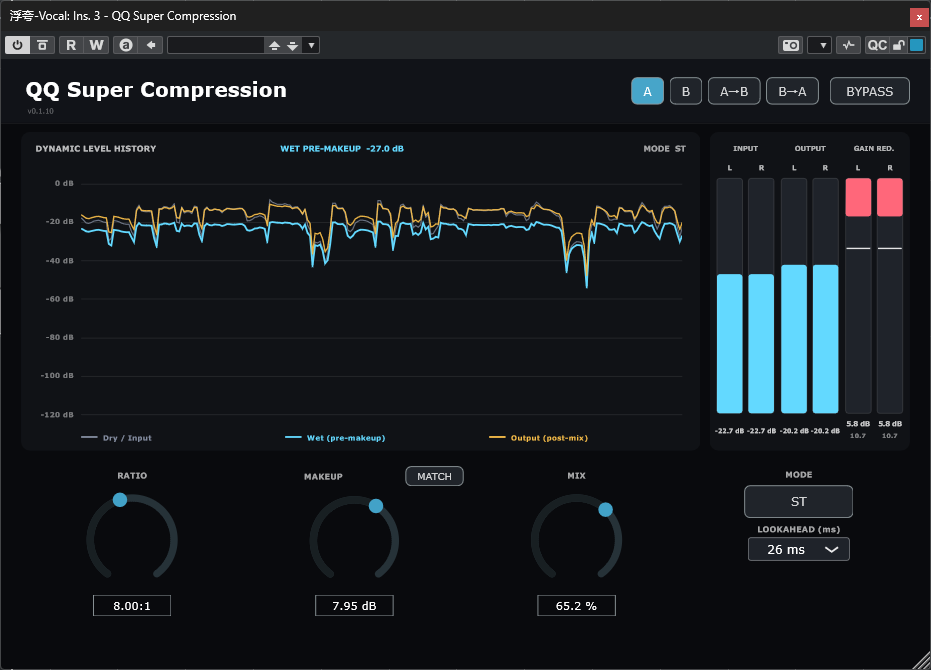

# QQ Super Compression 0.9.3

**Qing Audio 开源动态处理器 / Open-source dynamics processor by Qing Audio**

QQ Super Compression 面向一个具体的混音问题：素材需要动态收敛，但工程师不希望传统压缩器的 Attack / Release 同时重塑原始瞬态、音头和演奏表情。

QQ Super Compression addresses a specific mixing problem: the source needs dynamic control, but the engineer does not want conventional Attack / Release behaviour to reshape its original transient, onset, or articulation.

| 项目 / Item | 内容 / Value |
|---|---|
| 当前版本 / Current version | 0.9.3 |
| 状态 / Status | Stable baseline (Plan D policy) — macOS packages pending / 稳定基线（Plan D 规则），macOS 成品待补齐 |
| 厂商 / Vendor | Qing Audio |
| 格式 / Formats | Windows x64 VST3; macOS Apple Silicon VST3; macOS Intel VST3; macOS Universal 2 AU |
| 框架 / Framework | JUCE 8.0.15 / CMake / C++17 |
| 许可证 / License | MIT |

> **0.9.3 稳定基线 / Stable baseline:** 按 Plan D 规则，本版本作为稳定基线记录；当前已完成 Windows x64 VST3 的本机构建与安装验证，macOS 三类成品尚未生成，因此尚未创建跨平台下载 Release。
>
> **Stable baseline:** Under the Plan D policy, this version is recorded as the stable baseline. Windows x64 VST3 has passed local build and install verification; the three macOS products are not yet generated, so no cross-platform download Release has been created.


## 下载 / Download

- [最新 Release / Latest Release](https://github.com/Ziqing-Gu/QQ-Super-Compression/releases/latest)
- [QQ Super Compression 0.1.10 Release（固定版本 / fixed version）](https://github.com/Ziqing-Gu/QQ-Super-Compression/releases/tag/v0.1.10)
- [直接下载 0.1.10 完整包 / Direct download of the 0.1.10 umbrella package](https://github.com/Ziqing-Gu/QQ-Super-Compression/releases/download/v0.1.10/QQ.Super.Compression.0.1.10.zip)

正式 Release 只提供一个完整 ZIP：`QQ.Super.Compression.0.1.10.zip`。它包含 Windows x64 VST3、macOS Apple Silicon VST3、macOS Intel VST3、macOS Universal 2 AU，以及中英文安装说明。Windows 用户使用 Windows x64 包；Mac 用户只安装与机器架构匹配的一份 VST3（Apple Silicon/M 系列或 Intel），AU 是供 Logic Pro 等 AU 宿主使用的独立选择。

The formal Release contains one umbrella ZIP, `QQ.Super.Compression.0.1.10.zip`. It includes Windows x64 VST3, macOS Apple Silicon VST3, macOS Intel VST3, macOS Universal 2 AU, and both installation guides. Windows users should choose the Windows x64 package. Mac users should install only the VST3 matching their machine (Apple Silicon/M-series or Intel); the AU is a separate option for AU hosts such as Logic Pro.

- [中文安装与使用说明 / Chinese installation guide](https://github.com/Ziqing-Gu/QQ-Super-Compression/blob/v0.1.10/docs/QQ%20Super%20Compression%200.1.10%20Windows%E4%B8%8EmacOS%E5%AE%89%E8%A3%85%E4%BD%BF%E7%94%A8%E8%AF%B4%E6%98%8E%EF%BC%88%E4%B8%AD%E6%96%87%EF%BC%89.txt)
- [English installation and usage guide](https://github.com/Ziqing-Gu/QQ-Super-Compression/blob/v0.1.10/docs/QQ-Super-Compression-0.1.10-Windows-macOS-INSTALL.txt)

> **注意 / Important:** GitHub 自动生成的 **Source code (zip)** 和 **Source code (tar.gz)** 只是源码快照，不是可安装插件。请下载上面的 `QQ.Super.Compression.0.1.10.zip`。  
> GitHub's automatically generated **Source code (zip)** and **Source code (tar.gz)** files are source snapshots, not installable plug-ins. Download `QQ.Super.Compression.0.1.10.zip` above.

## 界面预览 / Interface preview



图中是一个有代表性的正常混音状态：ST 模式、26 ms Lookahead、8:1 Ratio 与并行 Mix，同时显示动态历史、输入/输出电平和 Gain Reduction。图中数值用于展示工作流，并非固定推荐设置。

This is a representative mixing state: ST mode, 26 ms Lookahead, an 8:1 Ratio, and parallel Mix, with dynamic history plus input, output, and Gain Reduction metering. The displayed values demonstrate the workflow rather than prescribe fixed settings.

## 为什么设计它 / Why it exists

传统压缩器的 Attack 和 Release 不只是控制“压多少”，也会改变增益开始下降和恢复的时间。慢 Attack 可能让音头穿过，快 Attack 可能更明显地削弱音头，Release 又会改变事件之后的恢复形状。这些都是很有价值的声音设计手段，但并不适合所有任务。

Conventional compressor Attack and Release do more than determine “how much” compression occurs. They shape when gain reduction begins and recovers. A slow Attack may let the onset through, a fast Attack may reduce it more strongly, and Release changes the recovery after the event. These are valuable sound-design tools, but they are not desirable in every situation.

QQ Super Compression 的目标是：

> **在需要压缩动态范围时，尽量保留素材原本的瞬态与起音特征。**

The design target is:

> **Control dynamic range while preserving the source's original transient and onset character as much as practical.**

| 素材 / Source | 传统时间包络可能改变的部分 / What conventional timing may reshape |
|---|---|
| 吉他 / Guitar | 拨片触弦与音符前沿 / pick attack and note front edge |
| 人声 / Vocals | 辅音、爆破音与字头 / consonants, plosives, and word onsets |
| 钢琴 / Piano | 琴槌敲击和起音辨识度 / hammer strike and onset identity |
| 贝斯 / Bass | 指弹或拨片的清晰度与律动 / finger or pick articulation and groove |

### 母带与 Mix Bus / Mastering and mix-bus use

QQ Super Compression 同样适用于母带链路和 Mix Bus。它可以作为传统 G Bus 类压缩器的一种替代选择，提供更稳定、连续的 Glue，同时减少对鼓和其他打击乐音头过分明显的改变。

QQ Super Compression is also suited to mastering chains and mix-bus processing. It can serve as an alternative to a conventional G Bus-style compressor, providing a more stable, continuous sense of glue while reducing overly obvious changes to drum and percussion onsets.

这不是在否定传统压缩器，也不是声称能够在所有信号上“完美保留瞬态”。它提供的是另一种工作方向：当动态控制是必要的，而 Attack / Release 式瞬态塑形不是目标时，使用未来窗口预读来减少对传统时间包络的依赖。

This is not an argument against conventional compressors, nor a claim of perfect transient preservation on every signal. It offers another direction: when dynamic control is needed but Attack / Release transient shaping is not the goal, future-window analysis reduces dependence on a conventional time envelope.

## 工作原理 / How it works

插件先延迟可听音频，同时查看对应样本之后的一段未来波形。未来窗口给出即将到来的峰值电平，Ratio 根据该电平直接计算增益，再把增益应用到时间对齐的原始波形。

The plug-in delays the audible path while examining a future waveform window. That window estimates the upcoming peak level, Ratio derives gain directly from the estimate, and the gain is applied to the time-aligned original waveform.

```text
Future waveform window
        -> estimate the level for a delayed sample
        -> derive threshold-free Ratio gain
        -> apply gain to the corresponding delayed waveform
        -> Makeup
        -> compensated Dry/Wet Mix
        -> Output
```

Lookahead 不只是“让压缩更快”。它让处理器在对应音频到达输出前获得未来信息，从而不必依靠 Attack 在瞬态已经发生后追赶它。

Lookahead is not merely a way to make compression “faster.” It gives the processor information before the corresponding audio reaches the output, so it does not need an Attack envelope to chase a transient after it has already arrived.

### 无阈值 Ratio / Threshold-free Ratio

```text
gain = 1 / (1 + (Ratio - 1) * level)
```

`level` 是归一化为 0..1 的未来窗口峰值；在 0 ms 时则是瞬时样本幅度。Ratio 1:1 在 Makeup/Mix 前为 unity，Ratio 增大时 Gain Reduction 增加。

`level` is the future-window peak normalized to 0..1, or instantaneous sample magnitude at 0 ms. Ratio 1:1 is unity before Makeup/Mix; increasing Ratio increases Gain Reduction.

这不是传统“超过 Threshold 后 4:1”的 dB 斜率。插件没有传统 Threshold，也没有隐藏的用户 Attack / Release 包络。

This is not a conventional “4:1 above Threshold” dB slope. The plug-in has no conventional Threshold and no hidden user Attack / Release envelope.

## 快速开始 / Quick start

**中文步骤**

1. 先选 Lookahead。26/40/80/100 ms 更接近插件主要的“动态控制但减少瞬态重塑”方向；0 ms 是额外保留的非线性色彩模式。
2. 调整 Ratio，观察 Gain Reduction 和听感变化。
3. 选择 ST、LR 或 MS 工作域。
4. 播放一段有代表性的素材后使用 Match，消除响度偏差。
5. 用 Makeup 做必要修正，再用 Mix 混合补偿延迟后的 Dry 与 Wet。

**English steps**

1. Choose Lookahead first. The 26/40/80/100 ms settings are closer to the main “dynamic control with less transient reshaping” direction; 0 ms is an additional nonlinear colour mode.
2. Adjust Ratio while watching Gain Reduction and listening to the result.
3. Choose the ST, LR, or MS processing domain.
4. Play representative material and use Match to remove loudness bias.
5. Fine-tune Makeup, then use Mix to blend time-aligned Dry and Wet.

## 0.1.10：只在 0 ms 使用 Oversampling / 0 ms-only Oversampling

0.1.9 曾把 1x/2x/4x/8x 作为所有 Lookahead 的实验选项。PluginDoctor 与宿主测试后，0.1.10 收敛为更明确的产品逻辑：

Version 0.1.9 exposed 1x/2x/4x/8x experimentally at every Lookahead. After PluginDoctor and host testing, 0.1.10 converges on a more focused design:

- **Lookahead = 0 ms：**显示单个按钮，循环 `1x -> 8x -> 16x -> 1x`；新实例记忆值默认 **8x**。
- **Lookahead = 10/26/40/80/100 ms：**隐藏 Oversampling 控件并强制 DSP 使用 **1x**，但保留用户上一次 0 ms 选择。
- **2x 和 4x 被有意移除：**用户实测两者在 0 ms 下仍有严重混叠，而 8x/16x 增加的延迟较小，中间倍率没有足够实际价值。
- **1x：**最原始的 0 ms 色彩与最强混叠；**8x：**默认实用平衡；**16x：**进一步降低 alias fold-back。
- Oversampling 只减少 0 ms 色彩产生的折返混叠，不负责消灭该模式本身的谐波与染色。

- **Lookahead = 0 ms:** one button cycles `1x -> 8x -> 16x -> 1x`; the remembered default for a new instance is **8x**.
- **Lookahead = 10/26/40/80/100 ms:** the control is hidden and DSP is forced to **1x**, while the user's previous 0 ms choice is preserved.
- **2x and 4x are intentionally absent:** user testing found severe aliasing remained at both factors, while the additional latency of 8x/16x was small enough that the intermediate factors offered little practical value.
- **1x:** rawest 0 ms colour and strongest aliasing; **8x:** default practical balance; **16x:** further alias-foldback reduction.
- Oversampling reduces fold-back from the 0 ms colour; it is not intended to remove that mode's harmonic character.

### PDC、Dry、Mix 与 Bypass

宿主报告的总延迟始终是活动 Lookahead 加上活动 0 ms FIR Oversampling 延迟。Dry、Mix 和 Bypass 使用完全相同的整数延迟，因此保持在同一时间线上。

Host-reported latency is always active Lookahead plus active 0 ms FIR Oversampling latency. Dry, Mix, and Bypass use the identical integer delay, keeping all paths on the same timeline.

- 0 ms / 1x：无 Oversampling FIR 延迟。
- 0 ms / 8x 或 16x：报告 FIR 延迟。
- 10 ms 以上：Oversampling 实际为 1x，只报告 Lookahead 延迟。

切换 Lookahead 或活动 Oversampling 倍率会改变真实插件延迟，宿主可能进行一次 PDC 重对齐。

Changing Lookahead or the active Oversampling factor changes real plug-in latency, so the host may perform a one-time PDC realignment.

## Lookahead 的声音意义 / What Lookahead means sonically

用户 PluginDoctor 测试观察到未来窗口长度与稳定低频信号的检测稳定性存在清晰关系：5 ms 约对应 99.6 Hz、10 ms 约 49.8 Hz、20 ms 约 24.9 Hz；26 ms 把边界推到约 20 Hz，40 ms 和 80 ms 对 20 Hz 继续更干净。

User PluginDoctor testing found a clear relationship between future-window length and stable low-frequency analysis: approximately 99.6 Hz at 5 ms, 49.8 Hz at 10 ms, and 24.9 Hz at 20 ms. A 26 ms window moved the boundary to roughly 20 Hz, while 40 ms and 80 ms became progressively cleaner at 20 Hz.

批准的预设为 `0 / 10 / 26 / 40 / 80 / 100 ms`。

The approved presets are `0 / 10 / 26 / 40 / 80 / 100 ms`.

0 ms 把 detector 折叠为瞬时样本幅度，产生有意保留的非线性/谐波色彩。未来开发不得以“修复”为名偷偷加入 smoothing、隐藏 Lookahead 或补偿 EQ。

At 0 ms the detector collapses to instantaneous sample magnitude, producing deliberately retained nonlinear/harmonic colour. Future development must not silently add smoothing, hidden Lookahead, or compensating EQ in the name of a “fix.”

## 处理模式 / Processing modes

- **ST — Stereo Linked：**L/R 分析独立，较强衰减控制共同增益，一个共享 Makeup。/ L/R are analysed independently; the stronger reduction drives one common gain and one shared Makeup.
- **LR — Left/Right Independent：**L/R 独立压缩与独立 Makeup。/ L/R compression and Makeup are independent.
- **MS — Mid/Side Independent：**`M=(L+R)*0.5`、`S=(L-R)*0.5`，M/S 独立处理后解码。/ M/S are processed independently before decoding.
- 模式按钮循环 `ST -> MS -> LR -> ST`。/ The Mode button cycles `ST -> MS -> LR -> ST`.

## 严格 Integrated LUFS Match / Strict Integrated LUFS Match

Match 使用 BS.1770 / EBU R128 Integrated Loudness 结构，而不是 RMS：K-weighting、400 ms blocks、75% overlap / 100 ms hop、-70 LUFS absolute gate、-10 LU relative gate；未完成的最后一个 block 不参与计算。

Match uses a BS.1770 / EBU R128 Integrated Loudness structure rather than RMS: K-weighting, 400 ms blocks, 75% overlap / 100 ms hop, a -70 LUFS absolute gate, and a -10 LU relative gate. An incomplete final block is ignored.

Match 比较延迟 Dry 与压缩后、Makeup 前、Mix 前的 Wet，并把结果写入 Makeup。它用于公平比较，不是持续运行的 Auto Gain。

Match compares delayed Dry with compressed Wet before Makeup and Mix, then writes the result to Makeup. It exists for fair comparison and is not a continuously operating Auto Gain stage.

- ST：一个 stereo programme 结果写入共同 Makeup。
- LR：L/R 独立测量并写入。
- MS：M/S 各自按 mono gated-LUFS 数学测量并写入。
- 静音或无有效 gated data 的通道保持原 Makeup。

## A/B、界面与工作流 / A/B, UI, and workflow

- A/B 保存 Ratio、全部 Makeup、Mix、Lookahead、0 ms Oversampling 记忆值和 Mode；Bypass 保持全局。
- A→B / B→A 参数复制。
- Shift-drag 精调，Alt+左键恢复默认，Ctrl/Cmd+Z Undo，Ctrl/Cmd+Shift+Z Redo。
- Dynamic Display：灰色为延迟 Dry/Input，青色为 Makeup 前 Wet，黄色为 Makeup/Mix 后 Output。
- Input、Output、Gain Reduction 三组双通道表；ST/LR 显示 L/R，MS 显示 M/S。
- 每路 Gain Reduction 有 2 秒自动 Peak Hold，仅用于显示。
- 完整 1020x670 设计空间按固定比例统一缩放。

- A/B stores Ratio, all Makeup values, Mix, Lookahead, the remembered 0 ms Oversampling choice, and Mode; Bypass remains global.
- A→B / B→A parameter copy.
- Shift-drag fine adjustment, Alt+left-click reset, Undo, and Redo.
- Dynamic Display: grey delayed Dry/Input, cyan pre-Makeup Wet, yellow post-Makeup/post-Mix Output.
- Dual-channel Input, Output, and Gain Reduction meters; ST/LR show L/R and MS shows M/S.
- Each Gain Reduction meter has a display-only 2-second automatic Peak Hold.
- The complete 1020x670 design space scales uniformly at a fixed aspect ratio.

## 状态迁移 / State migration

- 新实例的 0 ms Oversampling 记忆值默认为 8x。
- 0.1.8 或更早工程没有 Oversampling 参数时迁移到 8x。
- 0.1.9：旧 1x -> 新 1x；旧 2x/4x/8x -> 新 8x。
- 离开 0 ms 不会覆盖记忆值；返回 0 ms 时恢复。
- A/B、Undo/Redo 和工程状态都包含该记忆值。

- New instances remember 8x as the default 0 ms Oversampling choice.
- Version 0.1.8-or-earlier states without Oversampling migrate to 8x.
- Version 0.1.9: old 1x -> new 1x; old 2x/4x/8x -> new 8x.
- Leaving 0 ms does not overwrite the remembered choice; returning restores it.
- A/B, Undo/Redo, and project state all include the remembered choice.

## 完整包内的插件文件 / Plug-in files inside the umbrella package

| 包 / Package | 内容 / Contents |
|---|---|
| `QQ-Super-Compression-0.1.10-Windows-x64.zip` | Windows x64 VST3 |
| `QQ-Super-Compression-0.1.10-macOS-Apple-Silicon-VST3.zip` | macOS arm64 VST3 |
| `QQ-Super-Compression-0.1.10-macOS-Intel-VST3.zip` | macOS x86_64 VST3 |
| `QQ-Super-Compression-0.1.10-macOS-Universal-AU.zip` | macOS Universal 2 AU, arm64 + x86_64 |

这些是完整 Release ZIP 内的四个插件子包，并不是四个独立的 Release 资产。macOS 包使用 ad-hoc 签名，没有 Apple Developer ID 公证。安装与 quarantine 处理见下方说明。

These are the four plug-in subpackages inside the complete Release ZIP, not four separate Release assets. macOS bundles are ad-hoc signed and are not Apple Developer ID notarized. See the installation guides for installation and quarantine handling.

## 安装说明 / Installation guides

- [中文安装与使用说明](docs/QQ%20Super%20Compression%200.1.10%20Windows%E4%B8%8EmacOS%E5%AE%89%E8%A3%85%E4%BD%BF%E7%94%A8%E8%AF%B4%E6%98%8E%EF%BC%88%E4%B8%AD%E6%96%87%EF%BC%89.txt)
- [English installation and usage guide](docs/QQ-Super-Compression-0.1.10-Windows-macOS-INSTALL.txt)

## 验证状态 / Validation status

0.1.10 Windows x64 Release 已使用 JUCE 8.0.15 完成真实构建；源码 manifest、DLL/VST3 入口、x64 PE、moduleinfo、Steinberg validator 和 BS.1770 自测均通过。系统安装文件与交付文件 SHA-256 一致。

The 0.1.10 Windows x64 Release was built with JUCE 8.0.15. Source-manifest verification, DLL/VST3 entry points, x64 PE inspection, moduleinfo, Steinberg validator, and the BS.1770 self-test all passed. Installed and delivered module SHA-256 values match.

Cubase 的 0 ms 1x/8x/16x 听感、CPU、PDC、50% Mix、Bypass、自动化、状态迁移与最终用户确认仍需手动完成，因此本版本保持 Candidate/Test。

Manual Cubase validation of 0 ms 1x/8x/16x sound, CPU, PDC, 50% Mix, Bypass, automation, state migration, and final user acceptance is still required, so this release remains Candidate/Test.

## 完整版本历史 / Complete version history

下面记录从首个原型到当前版本的全部真实版本。所有版本均为 Candidate/Test；用户尚未确认任何版本为 Stable。更详细的技术记录见 [CHANGELOG.md](CHANGELOG.md)。

Every real version from the first prototype through the current build is recorded below. Version 0.9.3 is the stable baseline requested for this Plan D run; earlier entries retain their historical Candidate/Test labels. See [CHANGELOG.md](CHANGELOG.md) for the expanded technical record.

### 0.9.3 — 2026-08-27 — Stable baseline / 稳定基线

- 中文：恢复 v0.9.1 矢量暖光旋钮，保留 v0.9.2 Input/Output Gain、A/B、工程状态和 Undo/Redo；Windows x64 VST3 已完成 Release 构建与安装校验。
- English: Restored the v0.9.1 vector warm-light rotary while retaining v0.9.2 Input/Output Gain, A/B, project state, and Undo/Redo; Windows x64 VST3 passed Release build and install verification.
- 中文：按 Plan D 规则记录为稳定基线；macOS arm64 VST3、x86_64 VST3 和 Universal 2 AU 尚未生成，跨平台交付仍待补齐。
- English: Recorded as the stable baseline under the Plan D policy; macOS arm64 VST3, x86_64 VST3, and Universal 2 AU are not yet generated, so cross-platform delivery remains pending.

### 0.9.2 — 2026-08-27 — Candidate / Test

- 中文：引入 Input Gain、Output Gain 与 128 帧位图旋钮实验；输入增益进入检测/压缩路径，输出增益位于最终输出。
- English: Added Input Gain, Output Gain, and the 128-frame bitmap-knob experiment; Input Gain feeds detection/compression and Output Gain trims the final output.

### 0.9.1 — 2026-08-27 — Candidate / Test

- 中文：细化暖光/材质表现，修复 lookaheadMs 名称遮蔽警告，DSP 与布局保持不变。
- English: Refined the warm-light/material treatment, removed the lookaheadMs shadow warning, and kept DSP and layout unchanged.

### 0.9.0 — 2026-08-27 — Candidate / Test

- 中文：首次暖色透明 UI 候选，保留 0.1.10 DSP 基线。
- English: First warm transparent UI candidate, retaining the 0.1.10 DSP baseline.

### 0.1.10 — 2026-08-27 — Candidate / Test

- 中文：Oversampling 收敛为仅在 0 ms 显示的 `1x/8x/16x` 循环按钮，默认记忆 8x；10/26/40/80/100 ms 强制 1x，但保留上次 0 ms 选择。新增 16x 线性相位 FIR、整数延迟补偿，以及产品与 Oversampling 设计说明。0.1.8 或更早状态迁移到 8x；0.1.9 的 1x 保持 1x、2x/4x/8x 迁移到 8x。Windows 自动验证已通过；Cubase/PluginDoctor 的听感、CPU、PDC、Mix/Bypass、自动化与最终用户确认仍待人工完成。
- English: Oversampling was narrowed to a `1x/8x/16x` cycle button shown only at 0 ms, remembering 8x by default. The 10/26/40/80/100 ms modes force 1x while preserving the previous 0 ms choice. Added a 16x linear-phase FIR path, integer latency compensation, and dedicated product/Oversampling design notes. States from 0.1.8 or earlier migrate to 8x; 0.1.9 1x remains 1x while old 2x/4x/8x migrate to 8x. Windows automated validation passed; manual Cubase/PluginDoctor sound, CPU, PDC, Mix/Bypass, automation, and final user acceptance remain pending.

### 0.1.9 — 2026-08-27 — Candidate / Test

- 中文：首次加入实验性 `1x/2x/4x/8x` maximum-quality 线性相位 FIR Oversampling，并让 detector、future-window peak、Ratio smoothing/gain 在内部采样域运行；PDC、Dry、Mix 与 Bypass 使用 Lookahead + FIR 总延迟。Oversampling 进入状态、A/B、复制与 Undo/Redo。清理 `constrainer` 名称遮蔽警告。该通用菜单已由 0.1.10 的实测结论取代。
- English: Introduced experimental `1x/2x/4x/8x` maximum-quality linear-phase FIR Oversampling, moving detector, future-window peak, Ratio smoothing/gain into the internal sample domain. PDC, Dry, Mix, and Bypass used Lookahead plus FIR latency. Oversampling entered project state, A/B, copy, and Undo/Redo. The `constrainer` shadow warning was removed. This general-purpose menu was superseded by the measured 0.1.10 design.

### 0.1.8 — 2026-08-25（发布文档纠正：2026-08-26）— Candidate / Test

- 中文：改善 GR Hold 可读性，并以 1020x670 为根尺寸统一缩放整个 UI、锁定原始宽高比；旧非等比窗口尺寸会迁移到可容纳的最大等比尺寸。Ratio、检测、PDC、LUFS Match、A/B、参数 ID 与状态结构不变。随后补齐 MIT、公开 CI、四平台交付路线和双语文档；文档纠正未改 DSP。
- English: Improved GR Hold readability and uniformly scaled the full UI around a 1020x670 root while preserving its aspect ratio. Old non-proportional window sizes migrate to the largest proportional fit. Ratio, detection, PDC, LUFS Match, A/B, parameter IDs, and state structure were unchanged. MIT licensing, public CI, four-platform delivery, and bilingual documentation followed without changing DSP.

### 0.1.7 — 2026-08-25 — Candidate / Test

- 中文：为活动 GR 通道/分量加入 2 秒自动 Peak Hold；ST 联动，LR 的 L/R 独立，MS 的 M/S 独立，切换 Mode 或 Lookahead 会清除旧值。Hold 只影响显示。将局部 `playHead` 改名为 `hostPlayHead` 以清理遮蔽警告，并加入小型版本标签。
- English: Added a display-only two-second automatic Peak Hold to active GR channels/components: linked in ST, independent L/R in LR, and independent M/S in MS, with stale values cleared by Mode or Lookahead changes. Renamed local `playHead` to `hostPlayHead` to remove a shadow warning and added a small version label.

### 0.1.6 — 2026-08-25 — Candidate / Test

- 中文：用严格 BS.1770 / EBU R128 Integrated Loudness Match 取代 RMS/能量原型，采用 K-weighting、400 ms blocks、75% overlap、-70 LUFS 绝对门限与 -10 LU 相对门限。ST 写共同 Makeup，LR 与 MS 分别写各自分量；无有效门限数据时保持原值。未来峰值核心和 Lookahead 预设不变。
- English: Replaced the RMS/energy prototype with strict BS.1770 / EBU R128 Integrated Loudness Match using K-weighting, 400 ms blocks, 75% overlap, a -70 LUFS absolute gate, and a -10 LU relative gate. ST writes shared Makeup while LR and MS write their components independently; invalid gated data leaves the previous value unchanged. The future-peak core and Lookahead presets were unchanged.

### 0.1.5 — 2026-08-25 — Candidate / Test

- 中文：把 0–100 ms 任意输入收敛为 `0/10/26/40/80/100 ms` 六档，保留 `lookaheadMs` 参数 ID；旧值迁移到最近预设，等距选更长值。现有实例恢复工程值，新实例记住上次手动选择，无记录时默认 26 ms。Bypass 与 PDC 继续严格跟随 Lookahead；Match 当时仍是 RMS 原型。
- English: Replaced arbitrary 0–100 ms entry with `0/10/26/40/80/100 ms` presets while retaining the `lookaheadMs` parameter ID. Legacy values migrate to the nearest preset, choosing the longer value on ties. Existing instances restore project state; new instances remember the last manual choice or default to 26 ms. Bypass and PDC still follow Lookahead exactly; Match was still the RMS prototype.

### 0.1.4 — 2026-08-25 — Candidate / Test

- 中文：PluginDoctor 检查否定旧 20 ms rolling-RMS detector 后，加入可编辑 0–100 ms future-window Lookahead（初始 5 ms）。Lookahead 同时控制未来分析、实际音频延迟和宿主 PDC；Bypass 使用相同延迟 Dry。新增 L/R/M/S 无分配滑动未来峰值分析；0 ms 有意保留容易失真的色彩。
- English: After PluginDoctor testing rejected the old 20 ms rolling-RMS detector, added editable 0–100 ms future-window Lookahead (initially 5 ms). Lookahead controlled future analysis, real audio delay, and host PDC, while Bypass used the same delayed Dry path. Added allocation-free sliding future-peak analysis for L/R/M/S and deliberately retained the distortion-prone 0 ms colour.

### 0.1.3 — 2026-08-25 — Candidate / Test

- 中文：加入 A/B、A→B/B→A、Undo/Redo、Shift 精调、Alt 复位和窗口尺寸记忆；ST 使用共享 Makeup，LR 使用独立 L/R Makeup，MS 使用独立 M/S Makeup。加入能量式 Match 原型，但尚非严格 LUFS；保持 20 ms 检测和零对外延迟。
- English: Added A/B, A→B/B→A, Undo/Redo, Shift fine adjustment, Alt reset, and editor-size memory. ST used shared Makeup, LR independent L/R Makeup, and MS independent M/S Makeup. Added an energy Match prototype, not yet strict LUFS, while retaining 20 ms detection and zero externally reported latency.

### 0.1.2 — 2026-08-25 — Candidate / Test

- 中文：移除固定 10 ms 延迟并报告零样本延迟，移除 Makeup Gate，加入 ST/MS/LR 模式与双通道 Input/Output/GR 表。ST 联动、LR 独立、MS 独立，并保留 0.1.1 的无阈值电平域 Ratio。
- English: Removed the fixed 10 ms latency and reported zero samples, removed Makeup Gate, and added ST/MS/LR modes plus dual-channel Input/Output/GR meters. ST is linked, LR independent, and MS independent, retaining the 0.1.1 threshold-free level-domain Ratio.

### 0.1.1 — 2026-08-25 — Candidate / Test

- 中文：淘汰会随 Ratio 抬高电平并严重失真的 0.1.0 样本域 waveshaper，改为 Ratio 越大 Gain Reduction 越多的无阈值电平域增益控制。新增 Input、Output、Gain Reduction 表、Dynamic Display 和 UTF-8/CJK 字体回退。
- English: Rejected the 0.1.0 sample-domain waveshaper that raised level and caused severe distortion, replacing it with threshold-free level-domain gain control where higher Ratio produces more Gain Reduction. Added Input, Output, and Gain Reduction meters, Dynamic Display, and UTF-8/CJK font fallback.

### 0.1.0 — 2026-08-25 — Candidate / Test

- 中文：首个包含 Ratio、Makeup、Makeup Gate、Mix 和 0/10 ms 选项的原型。其样本域 waveshaper 后来被实测否定，因此该版只证明产品方向，不可作为 Stable 或兼容基线。
- English: Initial prototype with Ratio, Makeup, Makeup Gate, Mix, and 0/10 ms options. Its sample-domain waveshaper was later rejected by testing, so this build established direction only and must not be treated as a Stable or compatibility baseline.

## 构建 / Build

```text
cmake -S . -B build -DJUCE_PATH=/path/to/JUCE -DQQSC_FETCH_JUCE=OFF
cmake --build build --config Release --target QQSuperCompression_VST3
```

未指定本地 JUCE 时，可使用固定的 JUCE 8.0.15 FetchContent。Windows 使用 MSVC `/utf-8`；macOS 构建会同时启用 AU target。

When a local JUCE checkout is not supplied, the project can fetch pinned JUCE 8.0.15. Windows uses MSVC `/utf-8`; macOS configuration also enables the AU target.

完整构建与验证要求见 [CODEX_BUILD.md](CODEX_BUILD.md)。

See [CODEX_BUILD.md](CODEX_BUILD.md) for the complete build and validation requirements.

## 设计与开发文档 / Design and development documents

- [PRODUCT_DESIGN_NOTES.md](PRODUCT_DESIGN_NOTES.md) — 产品存在的原因、适用场景与不过度宣传边界 / why the product exists, use cases, and claim boundaries.
- [OVERSAMPLING_DESIGN_NOTES.md](OVERSAMPLING_DESIGN_NOTES.md) — 为什么只在 0 ms 使用 1x/8x/16x / why only 0 ms uses 1x/8x/16x.
- [CHANGELOG.md](CHANGELOG.md) — 完整中英双语版本记录 / complete bilingual changelog.
- [DEVELOPMENT_HISTORY.md](DEVELOPMENT_HISTORY.md) — 算法演进、失败方案和回滚路径 / algorithm evolution, rejected approaches, and rollback paths.
- [AI_DEVELOPMENT_HANDOFF.md](AI_DEVELOPMENT_HANDOFF.md) — 后续开发交接与不可破坏的设计约束 / future-development handoff and protected design constraints.
- [docs/TEST_CHECKLIST.md](docs/TEST_CHECKLIST.md) — DAW、PluginDoctor、PDC、状态与 UI 测试清单 / DAW, PluginDoctor, PDC, state, and UI checklist.

## 项目边界 / Project boundaries

- 不把传统压缩器描述成错误方案；本插件服务于不同的混音目标。
- 不声称在所有信号上完美保留瞬态。
- 不把 Ratio 描述成标准 threshold-slope Ratio。
- 不把 0 ms 描述成透明模式。
- 不在没有新测量与用户明确批准时重新加入 2x/4x、给 10 ms+ 开启 Oversampling、加入隐藏 smoothing 或补偿 EQ。
- 只有用户明确确认后，Candidate 才能标记为 Stable。

- Do not describe conventional compressors as incorrect; this plug-in serves a different mixing goal.
- Do not claim perfect transient preservation on every signal.
- Do not describe Ratio as a standard threshold-slope ratio.
- Do not describe 0 ms as a transparent mode.
- Do not restore 2x/4x, enable Oversampling at 10 ms+, add hidden smoothing, or add compensating EQ without new measurements and explicit user approval.
- A Candidate becomes Stable only after explicit user confirmation.

## License

MIT — see [LICENSE](LICENSE).
