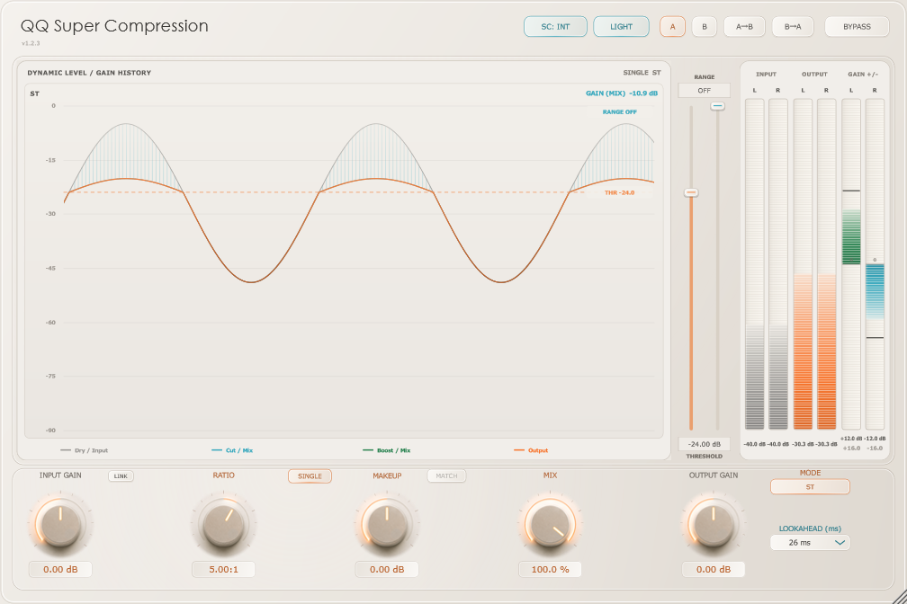
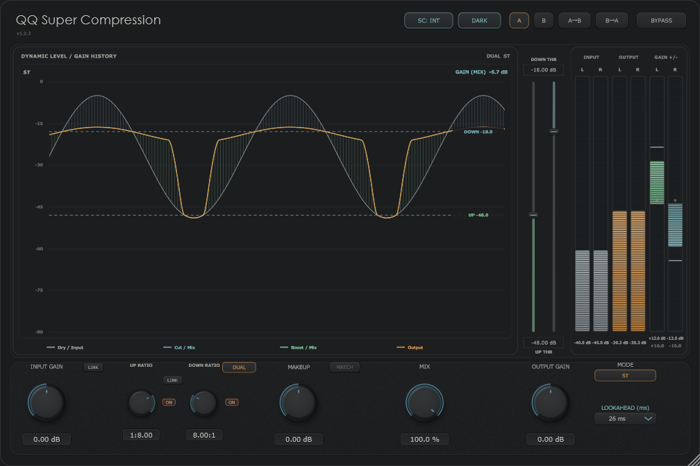

# ⚠️ 禁止商业使用 / NO COMMERCIAL USE

## Qing Audio 非商业源码共享许可证 1.0

### 本项目源码公开，但不属于 OSI 认可的开源软件

> **禁止任何商业使用。** 仅允许个人、学习、教育、研究、评估、爱好及其他非商业用途。发布原版、二进制版或修改版时，必须同时免费公开完整对应源代码，保留作者、版权和许可证声明，醒目标明原项目名称、作者、来源链接、修改者、修改日期及修改内容，并使整个修改版继续采用同一许可证。完整条款见 [LICENSE](LICENSE)。
>
> **NO COMMERCIAL USE.** Use is permitted only for personal, educational, research, evaluation, hobby, charitable, and other non-commercial purposes. Any distributed original, binary, or modified version must provide the complete corresponding source without charge, preserve authorship, copyright, and license notices, prominently identify the original project, author, source URL, modifier, date, and changes, and license the entire modified work under the same terms. See [LICENSE](LICENSE).
>
> 许可证政策变更与后续 AI 维护说明见 [LICENSE_POLICY_CHANGE.md](LICENSE_POLICY_CHANGE.md)。 / See [LICENSE_POLICY_CHANGE.md](LICENSE_POLICY_CHANGE.md) for the policy record and future AI maintenance instructions.

这是一个AI开发项目，大部分文字是由ChatGpt编辑，这些文字同时供用户和AI阅读。

所以如果你看到命令用语，那是给AI看的。

这个效果器看起来像是一个压缩，但其算法本质却与传统压缩效果器完全不同。

我最初设计它的初衷是，无阈值、无启动时间释放时间对瞬态的影响，另外还要像手动画音量Automation一样干净透明无染色。

有音频经验的人应该知道，对正弦波进行扭曲一定会引入谐波失真。

在没有Attack和Release表现下硬拐，如何降低谐波失真是一个很严肃的问题。

最终我找到的方案是，用lookahead的延迟去换取干净透明的声音。

不过到了后期，我发现在算法稳定后，引入阈值概念也是可以的。

这个效果器本质上是一个Dynamic Processor，这也是我不称其为“Compressor”而叫“Compression”的原因。

This is an AI‑development project. Most of the text was edited by ChatGPT, and these texts are meant to be read by both users and the AI.

if you see command‑style phrasing, those are intended for the AI.

This effect unit appears to function as a compressor, yet its underlying algorithm is fundamentally different from conventional compressors.

My original design goal was to eliminate threshold‑, attack‑ and release‑related influences on transients. On top of that, it needed to remain clean, transparent and color‑free, much like manually drawing volume automation.

Anyone with audio experience will know that distorting a sine wave inevitably introduces harmonic distortion.

Hard‑cornering without attack and release behaviour poses a serious challenge: how to reduce harmonic distortion.

The solution I ultimately arrived at is to trade lookahead latency for a clean, transparent sound.

Later on, however, once the algorithm became stable, I found it feasible to introduce a threshold parameter.

At its core, this is a dynamic processor. That is why I refer to it as "Compression" rather than a "Compressor".

↑↑↑↑↑↑↑↑↑↑这是作者自己写的 Wtitten By Author↑↑↑↑↑↑↑↑↑↑

# QQ Super Compression 1.2.3 Stable

**Fixed dB Ratio · Single / Upward / Dual · ST / LR / MS · Light / Dark / Classic**

有限阈值现在使用固定 dB Ratio：阈值 −10 dB、Ratio 5:1 时，0 dB 稳态输入在无额外增益时输出 −8 dB；阈值以下保持原增益。Lookahead 检测与增益平滑方式保留。对应分支的 −inf 阈值继续使用兼容曲线。

Finite thresholds now use a fixed dB ratio: at a −10 dB threshold and 5:1, steady 0 dB input produces −8 dB without additional gain; sub-threshold levels retain unity gain. Lookahead detection and gain smoothing remain. A corresponding −inf threshold retains the compatibility curve.

Single Ratio 为 1:1000～1000:1；Dual Up 为 1:1000～1:1，Down 为 1:1～1000:1，默认均为 1:1。保留相对 Ratio LINK，以及等量反向的 Input/Output LINK。

Single spans 1:1000–1000:1; Dual Up spans 1:1000–1:1 and Down 1:1–1000:1, all defaulting to unity. Relative Ratio LINK and equal-and-opposite Input/Output LINK are retained.

[1.2.3 Release](https://github.com/Ziqing-Gu/QQ-Super-Compression/releases/tag/v1.2.3) · [双语更新 / Release notes](RELEASE_NOTES_1.2.3.md) · [中文原理补充](START_1.2.3_CN.md) · [Algorithm guide](START_1.2.3_EN.md)

## 下载与安装 / Downloads and installation

Release 提供 Windows x64 VST3、macOS Apple Silicon VST3、Intel VST3 和 Universal 2 AU。Mac 要求 macOS 11 或更新；选择与宿主进程架构一致的 VST3。Mac 构建采用临时签名，未经过 Apple 公证。

The release provides Windows x64 VST3, Mac Apple Silicon / Intel VST3 and Universal 2 AU. macOS 11 or newer is required; match VST3 architecture to the host process. Mac bundles are ad-hoc signed, without Apple notarization.

- [中文安装指南](docs/QQ-Super-Compression-1.2.3-INSTALL-CN.txt)
- [English installation guide](docs/QQ-Super-Compression-1.2.3-INSTALL-EN.txt)
- [中文原版手册 · 23 页](docs/manuals/QQ%20Super%20Compression%20用户手册%20中文版_v1.2.0.pdf)
- [Original English manual · 23 pages](docs/manuals/QQ%20Super%20Compression%20User%20Manual%20English_v1.2.0.pdf)

两本 PDF 沿用已确认的 1.2.0 原文件。新的算法、Ratio 范围和联动行为以 1.2.3 安装指南及补充说明为准。

Both approved 1.2.0 PDFs are preserved unchanged. The 1.2.3 installation and supplemental guides take precedence for updated algorithms, Ratio ranges and links.

## 上压与双压 / Upward and Dual

上压提升下方 gate 以上、上边界以下的有效部分。Single 的有限 Range 上边界恢复为 0 dB 动态增益；Dual 到达 DOWN 阈值后结束上压，之后由 Down 处理。Ratio 8:1 与 1:8 在共同有效区间保留固定增益补偿后的对称关系，边界过渡除外。

Upward processing boosts eligible material above its lower gate and below the upper boundary. Single returns to unity dynamic gain at a finite Range. Dual stops Up at DOWN and applies Down above it. Reciprocal ratios retain symmetry after a constant gain offset in their common active interval, away from boundary transitions.

Dual 的两路 ON/OFF 和 10 ms Crossfade、Range 内侧连续回零、三套皮肤以及 Display 同步显示全部保留；没有增加 Attack/Release 参数。

Independent Dual switches with 10 ms crossfades, continuous gain return inside Range, all three skins and synchronized Display behavior remain. No Attack/Release parameter was added.

## 旧工程 / Existing projects

正式插件名称、VST3 身份和参数 ID 保留。有限阈值工程的声音会随新曲线变化；−inf 分支保持兼容。保存的实际 Ratio 数值继续读取，但从旧范围升级后的归一化自动化映射会变化。独立 QQ dB Compression 测试实例需手动替换为正式插件。

The formal name, VST3 identity and parameter IDs are retained. Finite-threshold projects change sound with the new curve; −inf branches retain compatibility. Saved absolute Ratio values load, but extending the old range changes normalized automation mapping. Separate QQ dB Compression test instances require manual replacement.

## Build and source

[Build instructions](CODEX_BUILD.md) · [Validation](VERIFICATION_1.2.3.md) · [Version coverage](PLAN_C_VERSION_COVERAGE_1.2.3.md)

JUCE 8.0.15 and CMake 3.22 or newer. Windows: Visual Studio 2022 x64. macOS: AppleClang, separate native VST3 targets and Universal 2 AU. The manual-dispatch GitHub workflows build the tagged source and verify native dynamics, architectures, signatures and AU validation.

Historical version-labelled documents remain as development records. Current 1.2.3 guides take precedence. The non-commercial source-share license above applies; third-party notices remain unchanged.
