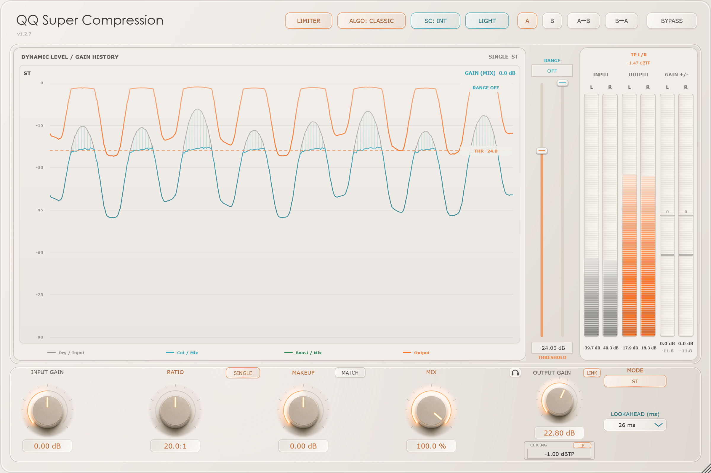
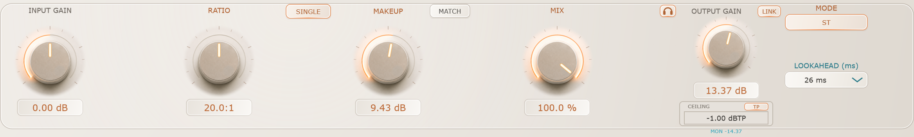
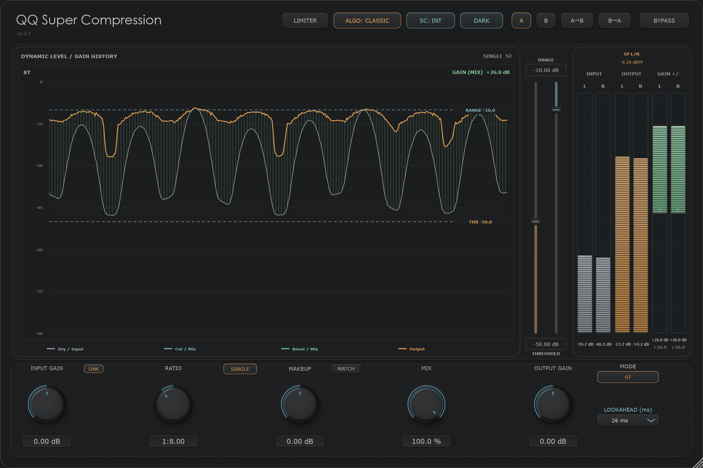
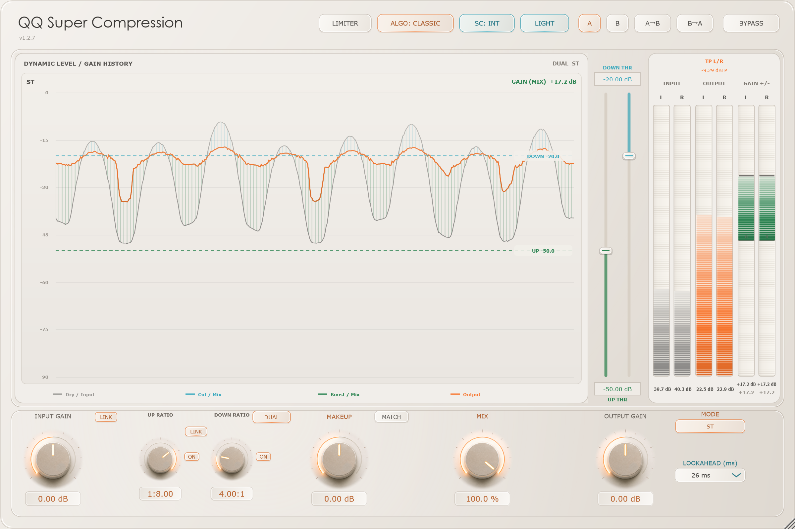

# ⚠️ 禁止商业使用 / NO COMMERCIAL USE

## Qing Audio 非商业源码共享许可证 1.0

### 本项目源码公开，但不属于 OSI 认可的开源软件

> **禁止任何商业使用。** 仅允许个人、学习、教育、研究、评估、爱好及其他非商业用途。发布原版、二进制版或修改版时，必须同时免费公开完整对应源代码，保留作者、版权和许可证声明，醒目标明原项目名称、作者、来源链接、修改者、修改日期及修改内容，并使整个修改版继续采用同一许可证。完整条款见 [LICENSE](LICENSE)。
>
> **NO COMMERCIAL USE.** Use is permitted only for personal, educational, research, evaluation, hobby, charitable, and other non-commercial purposes. Any distributed original, binary, or modified version must provide the complete corresponding source without charge, preserve authorship, copyright, and license notices, prominently identify the original project, author, source URL, modifier, date, and changes, and license the entire modified work under the same terms. See [LICENSE](LICENSE).
>
> 许可证政策变更与后续 AI 维护说明见 [LICENSE_POLICY_CHANGE.md](LICENSE_POLICY_CHANGE.md)。 / See [LICENSE_POLICY_CHANGE.md](LICENSE_POLICY_CHANGE.md) for the policy record and future AI maintenance instructions.

这是一个AI开发项目，大部分文字是由ChatGpt编辑，这些文字同时供用户和AI阅读。

所以如果你看到命令用语，那是给AI看的。

这个效果器看起来像是一个压缩，但其算法本质却与传统压缩效果器完全不同。

我最初设计它的初衷是，无阈值、无启动时间释放时间对瞬态的影响，另外还要像手动画音量Automation一样干净透明无染色。

有音频经验的人应该知道，对正弦波进行扭曲一定会引入谐波失真。

在没有Attack和Release表现下硬拐，如何降低谐波失真是一个很严肃的问题。

最终我找到的方案是，用lookahead的延迟去换取干净透明的声音。

不过到了后期，我发现在算法稳定后，引入阈值概念也是可以的。

这个效果器本质上是一个Dynamic Processor，这也是我不称其为“Compressor”而叫“Compression”的原因。

This is an AI‑development project. Most of the text was edited by ChatGPT, and these texts are meant to be read by both users and the AI.

if you see command‑style phrasing, those are intended for the AI.

This effect unit appears to function as a compressor, yet its underlying algorithm is fundamentally different from conventional compressors.

My original design goal was to eliminate threshold‑, attack‑ and release‑related influences on transients. On top of that, it needed to remain clean, transparent and color‑free, much like manually drawing volume automation.

Anyone with audio experience will know that distorting a sine wave inevitably introduces harmonic distortion.

Hard‑cornering without attack and release behaviour poses a serious challenge: how to reduce harmonic distortion.

The solution I ultimately arrived at is to trade lookahead latency for a clean, transparent sound.

Later on, however, once the algorithm became stable, I found it feasible to introduce a threshold parameter.

At its core, this is a dynamic processor. That is why I refer to it as "Compression" rather than a "Compressor".

↑↑↑↑↑↑↑↑↑↑这是作者自己写的 Wtitten By Author↑↑↑↑↑↑↑↑↑↑

# QQ Super Compression 1.2.8

**Classic / Super · Single / Upward / Dual · Limiter · TP / Peak · Headphone 1:1**

1.2.8 修复 Limiter 模式下 Single / Dual 切换的向下阈值连续性。切换时，Single Threshold 与 Dual DOWN Threshold 双向接续当前值；Makeup、Mix 和 Output Gain 保持不变。1.2.7 的 Limiter、Ceiling、TP、耳机 1:1、独立 Dual 算法及严格 Output LINK 行为全部保留。

Version 1.2.8 fixes downward-threshold continuity when switching Single / Dual in Limiter mode. Single Threshold and Dual DOWN Threshold now carry the current value in both directions, while Makeup, Mix and Output Gain remain unchanged. The 1.2.7 Limiter, Ceiling, TP, headphone 1:1, independent Dual algorithms and strict Output LINK behavior are retained.

当前阶段：Plan C（公开源码同步、四类跨平台成品与桌面用户包）。Windows 复用已验证的 Plan A 成品；macOS 构建与交付核验以本次 Plan C 记录为准。Plan D 仅指正式 GitHub Release，现暂缓；版本标签不代表成品已发布。

Current stage: Plan C (public source synchronization, four platform packages and desktop delivery). Windows reuses the verified Plan A output; macOS build and delivery verification are recorded for this Plan C. Plan D means the formal GitHub Release only and is deferred; a version tag does not indicate a published binary release.

[已发布版本 / Published releases](https://github.com/Ziqing-Gu/QQ-Super-Compression/releases) · [完整更新 / Release notes](RELEASE_NOTES_1.2.8.md) · [历史 / Changelog](CHANGELOG.md)

- [中文安装指南](docs/QQ-Super-Compression-1.2.8-INSTALL-CN.txt)
- [English installation guide](docs/QQ-Super-Compression-1.2.8-INSTALL-EN.txt)
- [1.2.7 中文用户手册 · 历史功能参考](docs/manuals/QQ-Super-Compression-1.2.7-User-Manual-Chinese.pdf)
- [1.2.7 English manual · historical feature reference](docs/manuals/QQ-Super-Compression-1.2.7-User-Manual-English.pdf)

Plan C 交付格式 / Plan C package formats: Windows x64 VST3 / macOS Apple Silicon VST3 / Intel VST3 / Universal 2 AU。macOS 构建目标为 11 或更高，采用临时签名、未经公证。The macOS build target is 11 or newer with ad-hoc signing, without Apple notarization.

四类成品已核验并交付桌面用户包。Apple Silicon 与 Intel 原生 Limiter、Unity、Dual 算法及模式连续性测试通过，Universal 2 AU 通过 auval；Windows 复用已验证的 Plan A 成品。三类 Mac 成品来自生产输入完全一致的公开提交，具体提交和任务见 [REPRODUCE.md](REPRODUCE.md)。正式 GitHub Release 仍待单独执行 Plan D。

All four packages have been verified and delivered in the desktop user package. Native Apple Silicon and Intel Limiter, Unity, Dual-algorithm and continuity checks pass; Universal 2 AU passes auval. Windows reuses the verified Plan A output. The Mac packages use public commits with identical production inputs; exact commits and jobs are documented in [REPRODUCE.md](REPRODUCE.md). The formal GitHub Release remains deferred to Plan D.

## 1.2.8 Limiter Single / Dual 连续性 / continuity

### 本次同步版本范围 / Versions covered by this synchronization

远端此前完整记录到 1.2.6。本次包括 1.2.7 与 1.2.8，遗漏版本：无。

The previous fully documented remote version was 1.2.6. This synchronization covers 1.2.7 and 1.2.8; omitted versions: none.

- **1.2.7：** 新增 Limiter 独立参数库、最终 Ceiling、TP/Peak、耳机 1:1 和 MATCH。该版本后续迭代加入普通/Limiter 独立模式记忆、LUFS、Ratio/Mix 修正、Dual Up/Down 独立算法和严格 Output LINK。最终输入基线为 Strict Output Link；1.2.7 历史手册不覆盖所有后续细节，当前行为以源码和补充说明为准。
- **1.2.7:** Added the independent Limiter bank, final Ceiling, TP/Peak, headphone 1:1 and MATCH. Later revisions within this version added independent Normal/Limiter mode memories, LUFS, Ratio/Mix fixes, independent Dual Up/Down algorithms and strict Output LINK. Strict Output Link is the input baseline; the historical manuals do not cover every later revision, so current behavior is defined by source and supplemental notes.
- **1.2.8：** 修复 Limiter Single/Dual 双向切换的向下阈值接续；保留 Makeup、Mix、Output、正常模式独立阈值、算法、插件身份和工程兼容性。
- **1.2.8:** Fixes downward-threshold continuity in both directions of Limiter Single/Dual switching, preserving Makeup, Mix, Output, normal-mode independent thresholds, algorithms, plug-in identity and project compatibility.

Limiter 中从 Single 切到 Dual 时，当前 Single Threshold 写入目标 DOWN Threshold；从 Dual 切回 Single 时，当前 DOWN Threshold 写入目标 Threshold。ST、L、R、M、S 分别接续自己的值。该规则不依赖 Limiter LINK、声道 LINK 或 Ratio LINK，且不会改写 Makeup、Mix、Output Gain、Ratio 或算法选择。

In Limiter mode, Single to Dual copies the current Single Threshold to the destination DOWN Threshold; Dual to Single copies the current DOWN Threshold to the destination Threshold. ST, L, R, M and S continue independently. The rule does not depend on Limiter, channel or Ratio links and does not rewrite Makeup, Mix, Output Gain, ratios or algorithm choices.

Normal compression keeps separate Single / Dual threshold memories. A/B, project load and Undo/Redo remain whole-state operations. Existing parameter IDs, order, plug-in identity and state schema 22 are unchanged.

## Limiter、TP 与耳机监听 / Limiter, TP and monitoring

Limiter 支持两种算法、Single / Dual 和 ST / LR / MS。下压 Ratio 为 200:1 至 1000:1；上压仍可使用。Ceiling 为 -24 至 0 dB，默认 0，Alt 单击复位。TP 与 Ceiling 只在 Limiter 下生效。TP 表读取实际最终 L/R 输出，保留约 20 秒峰值，双击清零。

Limiter supports both algorithms, Single / Dual and ST / LR / MS. Downward Ratio spans 200:1 to 1000:1; upward processing remains available. Ceiling spans -24 to 0 dB, defaults to 0 and resets with Alt-click. TP and Ceiling act only in Limiter. The meter reads actual final L/R true peaks, with about 20 seconds of hold and double-click reset.

Output 旁的 LINK 联动下压阈值与输出。耳机开启后，数值及联动仍有效，MON = Ceiling - Output Gain；MATCH 比较原始输入与实际限幅、监听补偿后的输出。耳机不自动保证等响，需先播放有代表性的素材，再使用 MATCH。耳机状态随工程保存，独立于 A/B；Limiter、TP、Ceiling 与 Limiter LINK 则随 A/B 保存。

LINK beside Output connects the downward threshold and output. Headphones preserve those values and links, with MON = Ceiling - Output Gain. MATCH compares original input with actual limited, compensated listening output. Headphones alone do not guarantee equal loudness: play a representative passage before using MATCH. Headphones are saved with the project but independent of A/B; Limiter, TP, Ceiling and Limiter LINK are recalled by A/B.

## 上压与双压 / Upward and Dual

上压提升下门槛以上、上边界以下的有效部分。Single 用 Threshold / Range；Dual 用 UP / DOWN 阈值及两个 Ratio，达到 DOWN 后结束上压，高于 DOWN 时只做下压。两路分别 ON/OFF，Ratio LINK 按相对反向倍数联动。

Upward processing boosts eligible material above its lower gate and below the upper boundary. Single uses Threshold / Range; Dual uses UP / DOWN thresholds and two ratios. Up ends at DOWN, and only Down acts above it. Each branch has an independent switch; Ratio LINK preserves relative inverse changes.

## 延迟与兼容 / Latency and compatibility

Classic / Super 的已接受检测方式和默认 26 ms Lookahead 保持不变。最终峰值保护另需约 7-8.5 ms 固定缓冲，48 kHz 下约 8.17 ms；关闭 Limiter / TP 时仍保留相同总延迟。普通处理与 1.2.6 对齐延迟后的验证结果一致。本版不承诺任意信号零失真；细节及测试边界见说明书与发行说明。

The accepted Classic / Super detector and initial 26 ms Lookahead remain. Final peak protection adds about 7-8.5 ms of fixed buffering, about 8.17 ms at 48 kHz; the same total latency is retained with Limiter / TP off. Validated normal processing matches 1.2.6 after delay alignment. This is not a universal zero-distortion guarantee; see the manuals and release notes for scope.

正式名称、插件身份和已有参数 ID 保留。旧工程缺少新参数时，Limiter 默认关闭；已保存的新工程恢复自身状态。关闭 Limiter 恢复普通 Ratio、边界与 Output；共享 Makeup、Mix、Input 保留当前值。

The formal name, plugin identity and existing parameter IDs remain. Old states without new parameters load with Limiter off; newer projects restore their saved state. Leaving Limiter restores normal Ratio, boundaries and Output, while shared Makeup, Mix and Input keep their current values.

## 构建与验证 / Build and validation

JUCE 8.0.15、CMake 3.22+；Windows 使用 VS 2022 x64。见 [构建方法](REPRODUCE.md)、[发行说明](RELEASE_NOTES_1.2.8.md) 和 [Windows 验证](VERIFICATION_1.2.8.md)。Mac 工作流对原生 VST3 执行 Limiter、Ceiling、耳机、MATCH、Unity、Dual 算法和 Single / Dual 连续性回归，并验证版本、架构、签名与 AU。

Use JUCE 8.0.15 and CMake 3.22+, with VS 2022 x64 on Windows. See the build, release notes and verification records above. Mac workflows run native Limiter, Ceiling, headphone, MATCH, Unity, Dual-algorithm and Single / Dual continuity regressions, verify version, architectures and signatures, and validate the AU.

历史版本文档保留供追溯。1.2.7 双语手册仍可用于既有功能，但不包含 1.2.8 的 Single / Dual 连续性修复；本页和 1.2.8 Release Notes 为该变化的当前说明。非商业源码共享许可保持不变，第三方声明保留。

Historical documents remain for reference. The 1.2.7 manuals still describe the established feature set but do not include the 1.2.8 Single / Dual continuity fix; this page and the 1.2.8 Release Notes are the current supplement. The non-commercial source-share license and third-party notices are retained.
